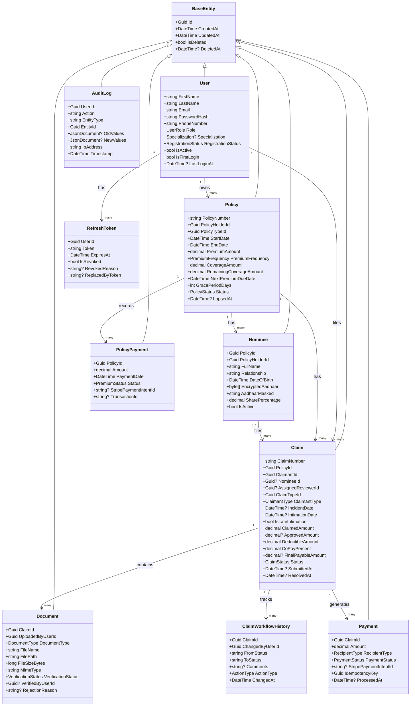

# Insurance Claim Processing System — Full Project Blueprint

> [!WARNING]
> ## User Review Required
> **Proposed Architectural Change: Removal of CQRS and MediatR**
> Moving to a traditional N-Tier Service Layer architecture (e.g. `ClaimService`). Please review the updated plan and confirm if you approve.
>
> **Feedback on `Claim.cs` provided:**
> 1. Duplicate `Status` properties (`Status` vs `ClaimStatus`).
> 2. Missing navigation properties (`User Claimant`, `Policy Policy`, `ClaimType ClaimType`, `Nominee Nominee`). EF Core needs these for relationships.
> 3. Removed `ClaimedAmount` and `CoPayPercent` in favor of `ClaimAmount` and `CoPayPercentage` (acceptable).
> 4. Added `AssignedManagerId` which wasn't in original design but is fine.
> 5. Added `RowVersion` for concurrency which is a great addition.

## 🎯 Project Overview

An enterprise-grade **Insurance Claim Processing System** that allows policyholders to submit claims, upload supporting documents, and track approval status — while ClaimReviewers verify, and ClaimsManagers approve or reject claims through a structured workflow.

---

## 👥 User Roles

| Role | Responsibility |
|------|----------------|
| **Admin** | System configuration, user creation, audit logs, reports |
| **ClaimsManager** | Final claim approval or rejection, oversight of all claims |
| **ClaimReviewer** | Document verification, claim review, recommendation to manager |
| **FinanceOfficer** | Payment processing for approved claims only |
| **Policyholder** | Submit claims, upload documents, track status |

---

## 🗃️ Core Entities & Database Design

### 1. `Users` Table
```
Users
├── UserId                      (PK, UUID)
├── FirstName                   (VARCHAR 100)
├── LastName                    (VARCHAR 100)
├── Username                    (VARCHAR 50, UNIQUE)   ← chosen at registration; login accepts Email OR Username
├── Email                       (VARCHAR 255, UNIQUE)
├── EmailVerifiedAt             (TIMESTAMP, NULLABLE)  ← set when user clicks verification link; null = unverified
├── PasswordHash                (VARCHAR)
├── PhoneNumber                 (VARCHAR 20)
├── Role                        (ENUM: Admin, ClaimsManager, ClaimReviewer, FinanceOfficer, Policyholder)
├── Specialization              (ENUM: Health, Auto, Life, Property, All, NULLABLE)
│                                ← Only set for ClaimReviewer role
│                                ← 'All' = can review any claim type (generalist)
├── RegistrationStatus          (ENUM: NA, PendingEmailVerification, PendingApproval, Approved, Rejected)
│                                ← NA                     = Admin-created staff accounts (auto-approved)
│                                ← PendingEmailVerification = Self-registered, email link not yet clicked
│                                ← PendingApproval        = Email verified; awaiting Admin KYC + identity review
│                                ← Approved               = Admin approved → account active
│                                ← Rejected               = Admin rejected → account inactive with reason
├── RegistrationRejectionReason (TEXT, NULLABLE)        ← filled by Admin when Status = Rejected
├── IsActive                    (BOOL, DEFAULT false)   ← false for self-registered, true for admin-created
├── IsFirstLogin                (BOOL, DEFAULT true)    ← admin-created staff forced to change password on first login
├── LastLoginAt                 (TIMESTAMP, NULLABLE)
├── FailedLoginAttempts         (INT, DEFAULT 0)        ← increments on each wrong password attempt
├── LockoutUntil                (TIMESTAMP, NULLABLE)   ← account locked for 15 min after 5 failed attempts
├── CreatedAt                   (TIMESTAMP)
└── UpdatedAt                   (TIMESTAMP)
```

> [!NOTE]
> **✅ FailedLoginAttempts + LockoutUntil are intentionally kept.**
> These are security fields, not financial fields. They power the 5-attempt brute-force lockout.
> Removing them would leave authentication with no protection against password guessing.
>
> **❌ Removed (mentor-confirmed out of scope):** `LastLoginIP` — `DeviceInfo` — `LoginHistory`

### 2. `Policies` Table
```
Policies
├── PolicyId                (PK, UUID)
├── PolicyNumber            (VARCHAR, UNIQUE)          ← e.g. POL-2024-0001
├── PolicyHolderId          (FK → Users)
├── PolicyTypeId            (FK → PolicyTypes)
├── StartDate               (DATE)
├── EndDate                 (DATE)
├── PremiumAmount           (DECIMAL 12,2)             ← premium amount per frequency cycle
├── PremiumFrequency        (ENUM: Monthly, Quarterly, HalfYearly, Annually)
├── CoverageAmount          (DECIMAL 12,2)
├── NextPremiumDueDate      (DATE)                     ← updated after each payment confirmed
├── LastPremiumPaidDate     (DATE, NULLABLE)           ← date of most recent successful payment
├── GracePeriodDays         (INT)                      ← 15 for Monthly, 30 for all others (IRDAI mandated)
├── RemainingCoverageAmount (DECIMAL 12,2)             ← starts = CoverageAmount; decreases per approved claim
├── Status                  (ENUM: PendingApproval, Active, GracePeriod, Lapsed, Expired, Rejected, Cancelled, CoverageExhausted)
│                            ← PendingApproval   = applied + paid first premium; awaiting Admin review
│                            ← Active            = Admin approved; premium paid and in force
│                            ← GracePeriod       = premium overdue, within grace window, still covered
│                            ← Lapsed            = grace period passed, no coverage, no new claims
│                            ← Expired           = natural policy end date reached
│                            ← Rejected          = Admin rejected the application
│                            ← CoverageExhausted = RemainingCoverageAmount = 0
├── RejectionReason         (TEXT, NULLABLE)           ← filled by Admin when Status = Rejected
├── LapsedAt                (TIMESTAMP, NULLABLE)      ← timestamp when policy first lapsed
├── CreatedAt               (TIMESTAMP)
└── UpdatedAt               (TIMESTAMP)
```

> [!IMPORTANT]
> **Policy Underwriting Flow (Online Only — No In-Person):**
> 1. Policyholder applies on website → selects plan template → fills personal details → pays first premium via Stripe Payment Intent
> 2. Policy created with `Status = PendingApproval` — payment recorded in `PolicyPayments` table
> 3. Admin reviews in dashboard → clicks Approve or Reject
> 4. **Approve** → `Status = Active`, StartDate set, `LastPremiumPaidDate` updated, welcome email sent
> 5. **Reject** → `Status = Rejected`, `RejectionReason` saved, rejection email sent
>
> **Cron jobs skip both `PendingApproval` and `Rejected` policies** — only `Active` and beyond are processed.
> **Claims cannot be filed** against `PendingApproval` or `Rejected` policies.
>
> ⚠️ **SIMPLIFIED**: No EMI schedule, no penalty calculation, no revival logic. Premium monitoring only.

### 3. `PolicyTypes` Table
```
PolicyTypes
├── PolicyTypeId           (PK, UUID)
├── TypeName               (VARCHAR)         ← Health, Auto, Life, Property
├── Description            (TEXT)
├── BenefitType            (ENUM: FixedBenefit, Reimbursement)
│                           ← FixedBenefit  = Life insurance (pays fixed sum regardless of actual cost)
│                           ← Reimbursement = Health / Auto / Property (pays actual loss)
├── AllowsNomineeClaim     (BOOL)            ← true for Life insurance policies
├── AllowsThirdPartyClaim  (BOOL)            ← true for Auto insurance policies
├── DefaultCoverageAmount  (DECIMAL 12,2)
└── IsActive               (BOOL)
```

### 4. `Claims` Table  ← Central entity
```
Claims
├── ClaimId                  (PK, UUID)
├── ClaimNumber              (VARCHAR, UNIQUE)              ← e.g. CLM-2024-0001
├── PolicyId                 (FK → Policies)
├── ClaimantId               (FK → Users)                  ← policyholder OR nominee
├── NomineeId                (FK → Nominees, NULLABLE)     ← set if Life claim filed by nominee
├── ClaimantType             (ENUM: Policyholder, Nominee, ThirdParty)
├── AssignedReviewerId       (FK → Users, NULLABLE)
├── ClaimTypeId              (FK → ClaimTypes)
├── IncidentDate             (DATE, NULLABLE)               ← NULL for Maturity / Survival claims
├── IncidentDescription      (TEXT, NULLABLE)
├── ClaimedAmount            (DECIMAL 12,2)                 ← actual loss (reimbursement) or fixed sum (life)
├── ApprovedAmount           (DECIMAL 12,2, NULLABLE)
├── PaymentRecipientType     (ENUM: Policyholder, Nominee, Hospital, ServiceProvider, ThirdParty)
├── RecipientName            (VARCHAR 200, NULLABLE)
├── RecipientAccountNumber   (VARCHAR 50,  NULLABLE)
├── RecipientBankName        (VARCHAR 100, NULLABLE)
├── Status                   (ENUM: Draft, Submitted, UnderReview, DocumentsPending, Approved, Rejected, Closed)
├── IntimationDate           (DATE, NULLABLE)               ← date policyholder reported the claim
├── IsLateIntimation         (BOOL, DEFAULT false)          ← true if intimated after deadline
├── DeductibleAmount         (DECIMAL 12,2, DEFAULT 0)
├── CoPayPercent             (DECIMAL 5,2,  DEFAULT 0)
├── FinalPayableAmount       (DECIMAL 12,2, NULLABLE)
├── SubmittedAt              (TIMESTAMP)
├── ResolvedAt               (TIMESTAMP, NULLABLE)
├── CreatedAt                (TIMESTAMP)
└── UpdatedAt                (TIMESTAMP)
```

> [!NOTE]
> **Payout Formula**: `FinalPayableAmount = MIN(ClaimedAmount, SubLimitAmount) × (1 - CoPayPercent/100) - DeductibleAmount`
> Populated by `ClaimService.CalculateApprovedPayout()` when ClaimsManager sets `ApprovedAmount`.
>
> **CoPayPercent source**: At claim submission, `ClaimValidationService` reads `PolicyBenefitRules.CoPayPercent`
> (seeded per policy type) and copies it onto the `Claim` record — exactly as `DeductibleAmount` is populated.
> This ensures the payout formula always uses the rule that was active when the claim was filed.
>
> **❌ Removed (mentor-confirmed out of scope):** `Priority` — `FraudScore` — `AutoEscalationLevel`

### 5. `ClaimTypes` Table
```
ClaimTypes
├── ClaimTypeId        (PK, UUID)
├── TypeName           (VARCHAR)
│                       Life     → Death, TerminalIllness, CriticalIllness, Maturity, SurvivalBenefit
│                       Health   → Hospitalization, DayCare, PrePostHospitalization
│                       Auto     → Accident, Theft, ThirdPartyLiability, NaturalCalamity
│                       Property → Fire, Flood, Theft, NaturalDisaster, Burglary
├── IsMaturityClaim    (BOOL)               ← true = no incident date needed (Maturity / Survival claims)
├── IsFixedBenefit     (BOOL)               ← true = pay sum assured, not actual loss
├── RequiredDocuments  (JSONB)              ← list of required document types per claim type
└── PolicyTypeId       (FK → PolicyTypes)
```

> ❌ **Removed (mentor-confirmed):** `SlaDays` — SLA tracking removed from scope.

### 6. `Documents` Table
```
Documents
├── DocumentId          (PK, UUID)
├── ClaimId             (FK → Claims)
├── UploadedByUserId    (FK → Users)
├── DocumentType        (ENUM: MedicalReport, PoliceReport, Invoice, Photo, IdentityProof, Other)
├── FileName            (VARCHAR)
├── FilePath            (VARCHAR)                    ← relative path: /uploads/claims/{claimId}/{filename}
├── FileSize            (BIGINT)                     ← in bytes; max 10 MB enforced at service layer
├── MimeType            (VARCHAR)
├── VerificationStatus  (ENUM: Pending, Verified, Rejected)
├── VerifiedByUserId    (FK → Users, NULLABLE)
├── VerifiedAt          (TIMESTAMP, NULLABLE)
├── RejectionReason     (TEXT, NULLABLE)
├── UploadedAt          (TIMESTAMP)
└── IsDeleted           (BOOL, DEFAULT false)
```

> [!IMPORTANT]
> Documents are for **claim evidence** only. KYC identity documents
> are stored in the separate `KYCDocuments` table (see below).

### 6b. `KYCDocuments` Table  ← Identity Verification at Registration
```
KYCDocuments
├── KYCDocumentId          (UUID, PK)
├── UserId                 (UUID, FK → Users)          ← the registering Policyholder
├── DocumentType           (ENUM: Aadhaar, PAN, Passport, VoterID)
├── FilePath               (VARCHAR)                   ← server path only; never exposed publicly
├── FileName               (VARCHAR)
├── FileSize               (BIGINT)                    ← bytes; auto-converted to WEBP if image
├── MimeType               (VARCHAR)
├── VerificationStatus     (ENUM: Pending, Verified, Rejected)
├── RejectionReason        (TEXT, NULLABLE)             ← Admin must supply reason if Rejected
├── VerifiedByAdminId      (UUID, FK → Users, NULLABLE) ← Admin who reviewed it
├── VerifiedAt             (TIMESTAMP, NULLABLE)
├── UploadedAt             (TIMESTAMP)
└── IsDeleted              (BOOL, DEFAULT false)        ← hard-deleted only when replaced after rejection
```

> - Minimum required: at least **one** KYC document uploaded before Admin can approve registration
> - Admin cannot approve a registration without reviewing KYC documents
> - If KYC rejected: Policyholder re-uploads; old rejected file hard-deleted after new upload succeeds
> - Aadhaar document file: stored encrypted at rest; never exposed via public URL

### 7. `ClaimWorkflowHistory` Table  ← Full audit trail
```
ClaimWorkflowHistory
├── HistoryId        (PK, UUID)
├── ClaimId          (FK → Claims)
├── ChangedByUserId  (FK → Users)
├── FromStatus       (VARCHAR)
├── ToStatus         (VARCHAR)
├── Comments         (TEXT)
├── ActionType       (ENUM: StatusChange, Assignment, DocumentRequest, Approval, Rejection, Escalation)
└── ChangedAt        (TIMESTAMP)
```

### 8. `Notifications` Table
```
Notifications
├── NotificationId   (PK, UUID)
├── RecipientUserId  (FK → Users)
├── ClaimId          (FK → Claims, NULLABLE)
├── Title            (VARCHAR 255)
├── Message          (TEXT)
├── Type             (ENUM: ClaimSubmitted, StatusChanged, DocumentRequired, ClaimApproved, ClaimRejected, Reminder)
├── Channel          (ENUM: InApp, Email, Both)
├── IsRead           (BOOL, DEFAULT false)
├── SentAt           (TIMESTAMP)
└── ReadAt           (TIMESTAMP, NULLABLE)
```

### 9. `AuditLogs` Table  ← Immutable, compliance-grade
```
AuditLogs
├── AuditId     (PK, UUID)
├── UserId      (FK → Users)
├── Action      (VARCHAR)              ← e.g. "Claim.Approved", "Policy.Rejected"
├── EntityType  (VARCHAR)              ← "Claim", "Document", "Policy"
├── EntityId    (UUID)
├── OldValues   (JSONB)
├── NewValues   (JSONB)
├── IpAddress   (VARCHAR)
├── UserAgent   (VARCHAR)
└── Timestamp   (TIMESTAMP)
```

### 10. `Comments` Table
```
Comments
├── CommentId     (PK, UUID)
├── ClaimId       (FK → Claims)
├── AuthorUserId  (FK → Users)
├── Message       (TEXT)
├── IsInternal    (BOOL)                    ← true = ClaimReviewer-only note; false = visible to Policyholder
├── IsDeleted     (BOOL, DEFAULT false)     ← soft-delete only; legal records must not be hard-deleted
├── DeletedAt     (TIMESTAMP, NULLABLE)
├── CreatedAt     (TIMESTAMP)
└── UpdatedAt     (TIMESTAMP)
```

### 11. `Payments` Table  ← Claim payout tracking
```
Payments
├── PaymentId              (PK, UUID)
├── ClaimId                (FK → Claims)
├── Amount                 (DECIMAL 12,2)
├── RecipientType          (ENUM: Policyholder, Nominee, Hospital, ServiceProvider, ThirdParty)
├── RecipientName          (VARCHAR 200, NULLABLE)   ← who receives the payment
├── RecipientAccountNumber (VARCHAR 50,  NULLABLE)   ← bank account number
├── RecipientBankName      (VARCHAR 100, NULLABLE)   ← bank name
├── PaymentMethod          (ENUM: BankTransfer, Cheque, DigitalWallet)
├── PaymentStatus          (ENUM: Pending, Processing, Completed, Failed)
├── StripePaymentIntentId  (VARCHAR, NULLABLE)
├── IdempotencyKey         (UUID, UNIQUE)            ← prevents duplicate Stripe charges on retry
├── TransactionReference   (VARCHAR)
├── ProcessedAt            (TIMESTAMP)
└── CreatedAt              (TIMESTAMP)
```

### 12. `Nominees` Table  ← Life Insurance Nominees
```
Nominees
├── NomineeId           (PK, UUID)
├── PolicyId            (FK → Policies)              ← nominee is tied to a specific policy
├── PolicyHolderId      (FK → Users)                 ← the original policyholder
├── FullName            (VARCHAR 200)
├── Relationship        (VARCHAR)                    ← Spouse, Child, Parent, Sibling
├── DateOfBirth         (DATE)
├── ContactPhone        (VARCHAR)
├── ContactEmail        (VARCHAR)
├── EncryptedAadhaar    (BYTEA)                      ← AES-256 encrypted; key stored in Azure Key Vault
├── AadhaarKeyReference (VARCHAR)                    ← Key Vault secret name used for this record
├── AadhaarMasked       (VARCHAR)                    ← stored as XXXX-XXXX-1234 (display only)
├── SharePercentage     (DECIMAL 5,2)                ← share of benefit if multiple nominees
├── IsActive            (BOOL)
└── CreatedAt           (TIMESTAMP)
```

> [!IMPORTANT]
> **Aadhaar Encryption — UIDAI & IT Act 2000 Compliance (Scoped to Nominees Only):**
> - **Scope**    : Only `Nominees.EncryptedAadhaar` — user profile is NOT encrypted
> - **Algorithm**: AES-256 applied before saving to DB
> - **Key Store**: Azure Key Vault — never in code or appsettings
> - **Key Ref**  : `AadhaarKeyReference` records which Key Vault secret was used
> - **Decrypt**  : Only during **death claim processing** — no other flow decrypts it
> - **Display**  : Only `AadhaarMasked` (XXXX-XXXX-1234) ever returned in API responses
> - **Logging**  : Never logged, never in error responses, never in plain text

### 13. `ThirdPartyClaimants` Table  ← Auto Insurance Third-Party Liability

> [!NOTE]
> **No separate service.** Handled entirely inside `ClaimService` as part of claim submission.
> No `ThirdPartyClaimantService`, no separate controller endpoint.

```
ThirdPartyClaimants
├── ThirdPartyId           (PK, UUID)
├── ClaimId                (FK → Claims)
├── FullName               (VARCHAR 200)
├── ContactPhone           (VARCHAR)
├── ContactEmail           (VARCHAR)
├── DamageDescription      (TEXT)
├── EstimatedDamageAmount  (DECIMAL 12,2)
├── PoliceReportNumber     (VARCHAR, NULLABLE)
└── CreatedAt              (TIMESTAMP)
```

### 14. `PolicyBenefitRules` Table  ← Rules Lookup (Seed Data Only)

> [!NOTE]
> **Seed-only — no Admin UI.** Seeded once at startup via `DbSeeder`.
> Read by `ClaimValidationService` as a rules lookup — no CRUD endpoints, no admin screens.
> To change rules: update the seed script and re-run migration.

```
PolicyBenefitRules
├── RuleId                      (PK, UUID)
├── PolicyTypeId                (FK → PolicyTypes)
├── ClaimTypeId                 (FK → ClaimTypes)
├── MaxClaimablePercent         (DECIMAL 5,2)   ← e.g. 100% for Life, 80% for Health
├── SubLimitAmount              (DECIMAL 12,2)  ← cap per sub-category (room rent, ICU etc.)
├── SubLimitDescription         (VARCHAR)       ← e.g. "Room rent capped at ₹2,000/day"
├── DeductibleAmount            (DECIMAL 12,2)  ← fixed amount subtracted from payout
├── WaitingPeriodDays           (INT)           ← days after policy start before claim is allowed
├── IntimationDeadlineDays      (INT)           ← days after event to report claim (IRDAI rule)
├── RequiresPoliceReport        (BOOL)          ← Auto theft, property burglary claims
├── RequiresMedicalCertificate  (BOOL)          ← Health, Life critical illness claims
├── RequiresDeathCertificate    (BOOL)          ← Life death claims
└── IsActive                    (BOOL)
```

### 15. `SystemHealthLogs` Table  ← API & System Monitoring
```
SystemHealthLogs
├── LogId               (PK, UUID)
├── CheckedAt           (TIMESTAMP, UTC)
├── ApiStatus           (ENUM: Healthy, Degraded, Unhealthy)
├── DatabaseStatus      (ENUM: Healthy, Degraded, Unhealthy)
├── ResponseTimeMs      (INT)                      ← API response time in milliseconds
├── ActiveClaims        (INT)                      ← count of open claims at check time
├── PendingOldClaims    (INT)                      ← claims older than 30 days without resolution
├── FailedPayments      (INT)                      ← Stripe payment failures in last window
├── ErrorMessage        (TEXT, NULLABLE)           ← populated if status is Unhealthy
└── CheckedBy           (VARCHAR)                  ← 'System' (Hangfire) or 'Manual' (Admin)
```

> [!NOTE]
> Populated by a **Hangfire recurring cron job** every **5 minutes** (`*/5 * * * *`).
> `GET /api/health` (public) · `GET /api/v1/admin/health-logs` (Admin only).

### 16. `PolicyPayments` Table  ← Premium Payment Tracking (Simplified)

> [!NOTE]
> **Mentor-confirmed:** Simple payment history only. Full payment engine (EMI, penalties, revival) is out of scope.

```
PolicyPayments
├── PaymentId              (PK, UUID)
├── PolicyId               (FK → Policies)
├── Amount                 (DECIMAL 12,2)             ← premium amount paid
├── PaymentDate            (TIMESTAMP)                ← when payment was made
├── Status                 (ENUM: Paid, Missed, Overdue)
│                           ← Paid    = premium received successfully
│                           ← Missed  = due date passed with no payment
│                           ← Overdue = within grace period, not yet paid
├── StripePaymentIntentId  (VARCHAR, NULLABLE)        ← Stripe transaction reference
├── TransactionId          (VARCHAR, NULLABLE)        ← Stripe charge ID for records
└── CreatedAt              (TIMESTAMP)
```

> [!IMPORTANT]
> **Grace Period Rules (IRDAI):**
> - Monthly premium            → Grace Period = **15 days**
> - Quarterly / Half-Yearly / Annual → Grace Period = **30 days**
> - During grace period: policy stays **Active**, claims still valid
> - After grace period expires with no payment → policy moves to **Lapsed**
>
> **❌ Not included (by design):** EMI schedules · Penalty calculations · Revival workflows · Waiver management

---

### 16b. `HealthRecords` Table  ← Initial Health Declaration for Claim Verification

> [!NOTE]
> **Purpose:** Captures policyholder health details at policy creation time.
> `ClaimValidationService` compares declared conditions vs claim reason.
> Mismatch → claim flagged for manual verification.

```
HealthRecords
├── RecordId            (PK, UUID)
├── PolicyId            (FK → Policies)              ← one health record per policy
├── PolicyHolderId      (FK → Users)
├── HeightCm            (DECIMAL 5,2)
├── WeightKg            (DECIMAL 5,2)
├── KnownConditions     (TEXT, NULLABLE)             ← e.g. "Diabetes, Hypertension"
├── IsSmoker            (BOOLEAN, DEFAULT false)
├── AlcoholConsumption  (VARCHAR, NULLABLE)          ← None, Occasional, Regular
├── DeclaredAt          (TIMESTAMP)                  ← when policyholder submitted this
└── CreatedAt           (TIMESTAMP)
```

> **Usage in claim flow:**
> - `ClaimValidationService` fetches `HealthRecords` for the policy during claim submission
> - Claim reason matches `KnownConditions` → flagged for manual review
> - Satisfies pre-existing condition check + document verification requirement
>
> **❌ Not included (by design):** Continuous health tracking · Wearables · Ongoing medical history

---

### 17. `RefreshTokens` Table  ← JWT Refresh Token Rotation
```
RefreshTokens
├── TokenId          (PK, UUID)
├── UserId           (FK → Users)
├── Token            (VARCHAR 500)           ← cryptographically random; stored hashed in DB
├── ExpiresAt        (TIMESTAMP)             ← UTC; 7 days from issue
├── IsRevoked        (BOOL)
├── RevokedAt        (TIMESTAMP, NULLABLE)
├── RevokedReason    (VARCHAR, NULLABLE)     ← "Used", "LoggedOut", "SuspiciousReuse"
├── ReplacedByToken  (VARCHAR, NULLABLE)     ← token rotation: records the successor token
└── CreatedAt        (TIMESTAMP)
```

> [!IMPORTANT]
> **Token Rotation:** On each refresh, old token is revoked and a new one issued.
> If a revoked token is presented again → entire token family is revoked (stolen token detection).
> Refresh token is stored in **httpOnly cookie** — never in localStorage.

### 18. `PasswordResetTokens` Table  ← Forgot Password Flow
```
PasswordResetTokens
├── ResetTokenId      (PK, UUID)
├── UserId            (FK → Users)
├── Token             (VARCHAR 500)          ← SHA-256 hashed; raw token emailed to user
├── ExpiresAt         (TIMESTAMP)            ← UTC; valid for 30 minutes from issue
├── IsUsed            (BOOL, DEFAULT false)
├── UsedAt            (TIMESTAMP, NULLABLE)
├── RequestedFromIp   (VARCHAR)
└── CreatedAt         (TIMESTAMP)
```

> [!NOTE]
> Token sent as link: `/reset-password?token=<raw>`. Backend hashes raw token and compares to DB.
> After use: `IsUsed = true`. Expired or used tokens are rejected. One active token per user at a time.

---

## 🔗 Entity Relationships

```
PolicyTypes ────< ClaimTypes ──< Claims
PolicyTypes ────< Policies   ──< Claims ──< Documents
Policies    ────< PolicyPayments          │──< ClaimWorkflowHistory
Policies    ────< HealthRecords           │──< Comments
PolicyTypes ────< PolicyBenefitRules     │──< Payments
Policies    ────< Nominees               └──< Notifications
                   └──> Claims.NomineeId
Claims ──< ThirdPartyClaimants
SystemHealthLogs ← populated by Hangfire health-check cron job (no FK)
RefreshTokens    ←─ Users (one user, many refresh tokens over time)
PasswordResetTokens ←─ Users (one active reset token per user)

Users (PolicyHolder) ──< Policies
Users (PolicyHolder) ──▶ HealthRecords.PolicyHolderId
Users (Reviewer)     ──▶ Claims.AssignedReviewerId
Users                ──▶ AuditLogs
Users                ──▶ Notifications
```

---


---

## 🧬 Class Diagram (Core Domain Entities)



---

## 🔌 Interface Architecture Diagram

> **Rule**: Application layer defines interfaces. Infrastructure layer implements them. Services depend on interfaces ONLY — never on concrete classes.

```
┌────────────────────────────────────────────────────────────────────────────┐
│                        APPLICATION LAYER                                   │
│                        (Defines Interfaces)                                │
│                                                                            │
│  ┌─────────────────────────────┐  ┌───────────────────────────────────┐  │
│  │     Repository Interfaces   │  │       CQRS Handlers               │  │
│  ├─────────────────────────────┤  ├───────────────────────────────────┤  │
│  │ IClaimRepository            │  │ SubmitClaimCommandHandler         │  │
│  │ IPolicyRepository           │  │ ApprovePolicyCommandHandler       │  │
│  │ IUserRepository             │  │ ProcessPaymentCommandHandler      │  │
│  │ IDocumentRepository         │  │ GetClaimByIdQueryHandler          │  │
│  │ IPaymentRepository          │  │ GetPagedClaimsQueryHandler        │  │
│  │ INotificationRepository     │  │ GetDashboardReportQueryHandler    │  │
│  │ IAuditLogRepository         │  └───────────────────────────────────┘  │
│  │ IPolicyPaymentRepository    │  ┌───────────────────────────────────┐  │
│  │ INomineeRepository          │  │  Pipeline Behaviours              │  │
│  │ IRefreshTokenRepository     │  ├───────────────────────────────────┤  │
│  │ IUnitOfWork                 │  │ ValidationBehaviour<TReq,TRes>    │  │
│  └─────────────────────────────┘  │ LoggingBehaviour<TReq,TRes>       │  │
│                                   │ PerformanceBehaviour<TReq,TRes>   │  │
│                                   └───────────────────────────────────┘  │
│  ┌──────────────────────────────────────────────────────────────────────┐ │
│  │               External Service Interfaces                            │ │
│  ├──────────────────────────────────────────────────────────────────────┤ │
│  │ IEmailService       IFileStorageService       IStripeService         │ │
│  │ IPiiEncryptionService      IAadhaarMaskingService                    │ │
│  └──────────────────────────────────────────────────────────────────────┘ │
└────────────────────────────────────────────────────────────────────────────┘
                                    ▲
                     Implemented by │  (Dependency Inversion)
                                    │
┌────────────────────────────────────────────────────────────────────────────┐
│                      INFRASTRUCTURE LAYER                                  │
│                      (Implements Interfaces)                               │
│                                                                            │
│  ClaimRepository       : IClaimRepository      (EF Core + PostgreSQL)     │
│  PolicyRepository      : IPolicyRepository     (EF Core + PostgreSQL)     │
│  UserRepository        : IUserRepository       (EF Core + PostgreSQL)     │
│  DocumentRepository    : IDocumentRepository   (EF Core + PostgreSQL)     │
│  PaymentRepository     : IPaymentRepository    (EF Core + PostgreSQL)     │
│                                                                            │
│  SmtpEmailService      : IEmailService         (MailKit/SMTP)             │
│  LocalFileStorageService : IFileStorageService  (wwwroot/uploads/)         │
│  StripePaymentService  : IStripeService        (Stripe.net SDK)           │
│  AesEncryptionService  : IPiiEncryptionService  (AES-256)                 │
│  AadhaarMaskingService : IAadhaarMaskingService (XXXX-XXXX-1234)          │
└────────────────────────────────────────────────────────────────────────────┘
```

### Interface Contracts (Key Examples)

```csharp
// Application/Interfaces/Repositories/IClaimRepository.cs
public interface IClaimRepository
{
    Task<Claim?> GetByIdAsync(Guid claimId);
    Task<Claim?> GetByIdWithDetailsAsync(Guid claimId);      // includes Documents, History
    Task<PagedResult<Claim>> GetPagedAsync(ClaimFilterDto filter, int page, int pageSize);
    Task<Claim> AddAsync(Claim claim);
    Task UpdateAsync(Claim claim);
    Task<bool> HasOpenClaimAsync(Guid policyId);             // for duplicate check
    Task<bool> HasMaturityClaimAsync(Guid policyId);         // for maturity duplicate guard
    Task<int> GetActiveClaimCountByReviewerAsync(Guid reviewerId); // for workload balance
}

// Application/Interfaces/Services/IClaimValidationService.cs
public interface IClaimValidationService
{
    Task<ValidationResult> ValidateSubmissionAsync(SubmitClaimDto dto, Guid policyHolderId);
    Task<decimal> CalculateApprovedPayoutAsync(Guid claimId, decimal claimedAmount);
}

// Application/Interfaces/External/IFileStorageService.cs
public interface IFileStorageService
{
    Task<string> SaveFileAsync(IFormFile file, Guid claimId);
    Task<(byte[] Content, string MimeType)> GetFileAsync(string filePath);
    Task DeleteFileAsync(string filePath);
}

// Application/Interfaces/External/IStripeService.cs
// SCOPE: Payment Intent creation and confirmation only.
// Refunds, subscriptions, invoices, webhooks complexity are OUT OF SCOPE.
public interface IStripeService
{
    // Create a PaymentIntent and return the clientSecret for the frontend
    Task<string> CreatePaymentIntentAsync(decimal amount, string currency,
        string idempotencyKey, Dictionary<string, string> metadata);

    // Confirm payment succeeded and return the Stripe charge/transaction ID
    Task<string> ConfirmPaymentAsync(string paymentIntentId);
}

// ─────────────────────────────────────────────────────────────────────
// ❌ NOT INCLUDED (mentor-confirmed out of scope):
//    RefundPaymentAsync()          ← no refund workflows
//    VerifyWebhookSignatureAsync() ← no webhook complexity
//    CreateSubscriptionAsync()     ← no subscription billing
//    CreateInvoiceAsync()          ← no invoices
// ─────────────────────────────────────────────────────────────────────
```

### DI Registration (Program.cs)
```csharp
// Repositories
builder.Services.AddScoped<IClaimRepository,    ClaimRepository>();
builder.Services.AddScoped<IPolicyRepository,   PolicyRepository>();
builder.Services.AddScoped<IUserRepository,     UserRepository>();
builder.Services.AddScoped<IDocumentRepository, DocumentRepository>();
builder.Services.AddScoped<IPaymentRepository,  PaymentRepository>();
builder.Services.AddScoped<IUnitOfWork,         UnitOfWork>();

// MediatR — CQRS (scans Application assembly for all handlers)
builder.Services.AddMediatR(cfg =>
    cfg.RegisterServicesFromAssembly(
        typeof(SubmitClaimCommand).Assembly));

// MediatR Pipeline Behaviours (order matters)
builder.Services.AddTransient(
    typeof(IPipelineBehavior<,>),
    typeof(LoggingBehaviour<,>));
builder.Services.AddTransient(
    typeof(IPipelineBehavior<,>),
    typeof(ValidationBehaviour<,>));
builder.Services.AddTransient(
    typeof(IPipelineBehavior<,>),
    typeof(PerformanceBehaviour<,>));

// FluentValidation — scans Application assembly for all validators
builder.Services.AddValidatorsFromAssembly(
    typeof(SubmitClaimCommandValidator).Assembly);

// AutoMapper — scans Application assembly for all profiles
builder.Services.AddAutoMapper(
    typeof(ClaimMappingProfile).Assembly);

// Application Services
builder.Services.AddScoped<IClaimValidationService, ClaimValidationService>();
builder.Services.AddScoped<IPremiumPaymentService,  PremiumPaymentService>();
builder.Services.AddScoped<INotificationService,    NotificationService>();
builder.Services.AddScoped<IReportService,          ReportService>();

// External Services
builder.Services.AddScoped<IEmailService,       SmtpEmailService>();
builder.Services.AddScoped<IFileStorageService, LocalFileStorageService>();
builder.Services.AddScoped<IStripeService,      StripePaymentService>();
builder.Services.AddSingleton<IPiiEncryptionService,    AesEncryptionService>();
builder.Services.AddSingleton<IAadhaarMaskingService,   AadhaarMaskingService>();

// Options (strongly-typed config)
builder.Services.Configure<JwtSettings>(
    builder.Configuration.GetSection(nameof(JwtSettings)));
builder.Services.Configure<SmtpSettings>(
    builder.Configuration.GetSection(nameof(SmtpSettings)));
builder.Services.Configure<StripeSettings>(
    builder.Configuration.GetSection(nameof(StripeSettings)));

// Middleware pipeline (order is mandatory)
app.UseMiddleware<CorrelationIdMiddleware>();
app.UseMiddleware<GlobalExceptionMiddleware>();
app.UseHttpsRedirection();
app.UseRateLimiter();
app.UseAuthentication();
app.UseAuthorization();
app.MapControllers();
```

---

## 🏦 Insurance Type Behavior Rules (Enforced in Service Layer)

### Life Insurance
| Rule | How System Handles It |
|------|-----------------------|
| Fixed sum benefit (not cost-based) | `ClaimService` ignores actual bills; pays full `SumAssured` from Policy |
| Nominee can file claim | `ClaimantType = Nominee`; `NomineeId` linked; nominee's identity verified |
| Maturity/Survival benefit | `IsMaturityClaim = true`; no `IncidentDate` required; triggered by policy `EndDate` |
| Benefit paid regardless of cost | Validation skips cost-vs-bill check for Life claims |
| Death certificate required | `PolicyBenefitRules.RequiresDeathCertificate = true` |

### Health Insurance
| Rule | How System Handles It |
|------|-----------------------|
| Reimbursement-based | `ClaimedAmount` validated against actual medical bills |
| Capped at Sum Insured | `ClaimedAmount ≤ Policy.CoverageAmount` enforced |
| Payment to hospital/policyholder | `PaymentRecipientType` = Hospital or Policyholder |
| Medical certificate required | `PolicyBenefitRules.RequiresMedicalCertificate = true` |

### Auto Insurance
| Rule | How System Handles It |
|------|-----------------------|
| Third-party compensation | `ThirdPartyClaimants` table; `ClaimantType = ThirdParty` |
| Covers incurred loss | `ClaimedAmount` validated against repair/damage estimate |
| Police report required (theft/accident) | `PolicyBenefitRules.RequiresPoliceReport = true` |
| Payment to service centre | `PaymentRecipientType = ServiceProvider` |

### Property Insurance
| Rule | How System Handles It |
|------|-----------------------|
| Covers incurred loss/damage | `ClaimedAmount` validated against surveyor estimate |
| Third-party liability | `ThirdPartyClaimants` table supported |
| Police report for theft/burglary | `PolicyBenefitRules.RequiresPoliceReport = true` |

---

## 🎨 Frontend Design (Angular)

### Design System
| Token | Value |
|-------|-------|
| Primary | Deep Blue `#1E3A5F` |
| Accent | Gold `#F0A500` |
| Success | `#22C55E` |
| Danger | `#EF4444` |
| Warning | `#F59E0B` |
| Font Heading | Poppins |
| Font Body | Inter |
| Border Radius | 12px (cards), 8px (buttons) |

### Angular Module Structure
```
src/app/
├── core/
│   ├── auth/            ← JWT interceptor, auth guard, role guard
│   ├── services/        ← API service classes
│   ├── models/          ← TypeScript interfaces & enums
│   └── utils/           ← date helpers, formatters
├── shared/
│   ├── components/      ← status-badge, file-uploader, timeline, data-table
│   └── pipes/           ← currency, date-relative, claim-status
├── modules/
│   ├── dashboard/       ← role-specific dashboards
│   ├── policies/        ← list, detail, create/edit
│   ├── claims/          ← submit wizard, list, detail
│   ├── documents/       ← upload, preview, verify
│   ├── approvals/       ← review queue, approve/reject panel
│   ├── notifications/   ← bell + full notification page
│   ├── audit-logs/      ← searchable audit table
│   ├── reports/         ← charts, export
│   └── admin/           ← user management, system config
└── layouts/
    ├── main-layout/     ← sidebar + topbar
    └── auth-layout/     ← centered card
```

### Key Screens

| Screen | Route | Access |
|--------|-------|--------|
| Login | `/auth/login` | Public |
| Register | `/auth/register` | Public |
| Forgot Password | `/auth/forgot-password` | Public |
| Reset Password | `/auth/reset-password` | Public |
| Dashboard | `/dashboard` | All roles |
| Policies List | `/policies` | Admin, Policyholder |
| Policy Detail | `/policies/:id` | Admin, Policyholder |
| Pay Premium | `/policies/:id/pay` | Policyholder |
| Request Revival | `/policies/:id/revive` | Policyholder |
| Submit Claim (Wizard) | `/claims/new` | Policyholder |
| Claims List | `/claims` | All roles |
| Claim Detail | `/claims/:id` | All roles |
| Document Verification | `/claims/:id/documents` | ClaimReviewer, ClaimsManager |
| Approval Queue | `/approvals` | ClaimsManager |
| Payment Queue | `/finance/payments` | FinanceOfficer |
| Process Payment | `/finance/payments/:claimId` | FinanceOfficer |
| Notifications | `/notifications` | All roles |
| Audit Logs | `/audit-logs` | Admin |
| Reports | `/reports` | Admin, ClaimsManager, FinanceOfficer |
| User Management | `/admin/users` | Admin |
| Registration Requests | `/admin/registrations` | Admin |
| System Health | `/admin/health` | Admin |

---

## 🔄 Claim Lifecycle

```
[Draft] ──Submit──> [Submitted] ──Assign──> [UnderReview]
                                                  │
                              ┌───────────────────┤
                              │                   │
                    [DocumentsPending]       [Approved]──> Payment ──> [Closed]
                              │                   │
                    Upload Docs │           [Rejected]──> Notify ──> [Closed]
                              │
                         [UnderReview] (back to review)
```

---

## 🏗️ Backend Architecture (ASP.NET Core)

```
┌─────────────────────────────────────────┐
│            Angular Frontend             │
└───────────────────┬─────────────────────┘
                    │ HTTPS + JWT Bearer
┌───────────────────▼─────────────────────┐
│        ASP.NET Core Web API             │
│  Controllers → Middleware Pipeline      │
│  (Rate Limiting, CORS, Auth, Logging)   │
└───────────────────┬─────────────────────┘
                    │ calls Service Method
┌───────────────────▼─────────────────────┐
│       Application Service Layer         │
│  IClaimService, IPolicyService          │
│  (Validates DTOs, Executes Logic)       │
└───────────────────┬─────────────────────┘
                    │ returns Result<T>
┌───────────────────▼─────────────────────┐
│       Domain / Application Layer        │
│  Business logic, validation, workflow   │
│  Services, Validators, Mappers          │
└───────────────────┬─────────────────────┘
                    │
┌───────────────────▼─────────────────────┐
│         Repository + Unit of Work       │
│  IUnitOfWork wraps all DB writes        │
└───────────────────┬─────────────────────┘
                    │
┌───────────────────▼─────────────────────┐
│    Infrastructure / EF Core             │
│  PostgreSQL + Local File Storage        │
└─────────────────────────────────────────┘
```

---

## 🏢 Enterprise-Grade Patterns

> These patterns are applied throughout every layer. They are what separates professional-grade
> backend code from a basic CRUD application.

---

### 1. 🔀 Traditional N-Tier Service Layer (Replaces CQRS/MediatR)

The application uses a traditional Service Layer pattern. Controllers inject domain-specific interfaces (e.g., `IClaimService`) and call methods directly.

```
Controller → IClaimService.SubmitClaimAsync(dto) → Validation → Business Logic → Result<T>
```

#### Folder Structure
```
Application/
├── Services/
│   ├── Claims/
│   │   ├── ClaimService.cs
│   │   └── IClaimService.cs
│   ├── Policies/
│   ├── Auth/
│   ├── Documents/
│   └── Payments/
├── DTOs/
├── Validators/
```

#### Example — Submit Claim (Service Layer)
```csharp
// Application/DTOs/SubmitClaimDto.cs
public sealed record ThirdPartyClaimantDto(
    string  FullName,
    string  ContactPhone,
    string  ContactEmail,
    string  DamageDescription,
    decimal EstimatedDamageAmount,
    string? PoliceReportNumber);

public record SubmitClaimDto(
    Guid                   PolicyId,
    Guid                   ClaimTypeId,
    decimal                ClaimedAmount,
    DateTime?              IncidentDate,
    string?                IncidentDescription,
    ThirdPartyClaimantDto? ThirdPartyClaimant
);

// Application/Services/Claims/ClaimService.cs
namespace InsuranceClaimSystem.Application.Services.Claims;

public class ClaimService : IClaimService
{
    private readonly IClaimRepository      _claimRepository;
    private readonly IPolicyRepository     _policyRepository;
    private readonly IClaimValidationService _validationService;
    private readonly IUnitOfWork           _unitOfWork;
    private readonly IMapper               _mapper;
    private readonly ILogger<ClaimService> _logger;

    public ClaimService(
        IClaimRepository claimRepository,
        IPolicyRepository policyRepository,
        IClaimValidationService validationService,
        IUnitOfWork unitOfWork,
        IMapper mapper,
        ILogger<ClaimService> logger)
    {
        _claimRepository   = claimRepository;
        _policyRepository  = policyRepository;
        _validationService = validationService;
        _unitOfWork        = unitOfWork;
        _mapper            = mapper;
        _logger            = logger;
    }

    public async Task<Result<ClaimResponseDto>> SubmitClaimAsync(
        SubmitClaimDto request, CancellationToken cancellationToken)
    {
        _logger.LogInformation("Submitting claim for PolicyId {PolicyId}", request.PolicyId);

        // 1. Validate business rules
        Result validationResult = await _validationService.ValidateSubmissionAsync(request);
        if (validationResult.IsFailure)
            return Result.Failure<ClaimResponseDto>(validationResult.Error);

        // 2. Create domain entity
        Claim claim = Claim.Create(request);

        // 3. Persist
        await _claimRepository.AddAsync(claim, cancellationToken);
        await _unitOfWork.SaveChangesAsync(cancellationToken);

        _logger.LogInformation("Claim {ClaimNumber} created successfully", claim.ClaimNumber);

        return Result.Success(_mapper.Map<ClaimResponseDto>(claim));
    }
}
```

### 2. 🛡️ Validation

Since we removed MediatR, validation needs to be handled either in the Controllers, or using a custom ActionFilter, or by manually injecting and invoking `IValidator<T>` in the services. We will use the built-in ASP.NET Core approach with FluentValidation ASP.NET Core integration, or manual validation checks at the start of service methods.

```csharp
// Example Manual Validation in Service
var validationResult = await _validator.ValidateAsync(dto);
if (!validationResult.IsValid) {
    // Return structured failure result
}
```

### 3. ⚠️ Global Error Handling
- **Global Exception Middleware** in ASP.NET Core:
  - Catches unhandled exceptions
  - Returns structured JSON error (never raw stack traces to client)
  - Logs full details internally
- **Problem Details (RFC 7807)** format for error responses
- **Angular HTTP Interceptor**:
  - Handles 401 → auto-refresh token or redirect to login
  - Handles 403 → show "Access Denied" page
  - Handles 500 → show friendly toast notification
  - Retry logic for transient network failures (3 retries with backoff)

---

### 4. 📋 Validation (Two Layers)
- **Backend (FluentValidation)**:
  - Validate all DTOs before hitting service layer
  - Business rules (e.g., "cannot submit claim on expired policy")
  - Return 400 with field-level error messages
- **Frontend (Angular Reactive Forms)**:
  - Real-time validation feedback
  - Custom validators (e.g., incident date cannot be in the future)
  - Disable submit button until form is valid

---

### 5. 📝 Logging, Observability & System Health
- **Serilog** (structured logging):
  - Console sink (dev) + File sink (production logs)
  - Log levels: Debug → Info → Warning → Error → Critical
- **Correlation IDs**: Every request gets a unique `X-Correlation-ID` header, logged throughout the pipeline
- **Request/Response logging middleware**: Log method, path, status, duration
- **Log sensitive data safely**: Never log passwords, tokens, Aadhaar, PAN, or any PII

#### 🏥 System Health Logs
- **Hangfire cron job** (`*/5 * * * *`) → checks API status, DB connectivity, response time every 5 minutes
- Results written to `SystemHealthLogs` table
- **Premium Payment Schedule** (Table 16): Tracks `PolicyId`, `DueDate`, `AmountDue`, `Status` (Pending/Paid/Overdue)
- **Admin Health Dashboard** widget shows: API status, DB status, avg response time, SLA breaches, failed payments
- **Public health endpoint**: `GET /api/health` → returns `{ status: "Healthy", db: "Connected" }` (no sensitive data)
- **Admin health endpoint**: `GET /api/v1/admin/health-logs` → full log history with trends
- **Alerts**: If `ApiStatus = Unhealthy` → immediate email to Admin

> [!IMPORTANT]
> **Cron Job Safety Rule — `CoverageExhausted` Status:**
> Both `GracePeriodLapseJob` and `PolicyExpiryJob` must explicitly **skip** any policy where
> `Status = CoverageExhausted`. Query filter: `WHERE Status NOT IN ('CoverageExhausted', 'Cancelled')`.
> These statuses are terminal — no cron job should ever overwrite them. Failing to add this
> filter will silently corrupt `CoverageExhausted` policies into `Lapsed` or `Expired` status.

#### 🇮🇳 IRDAI Compliance Logging
- **What is IRDAI?** Insurance Regulatory and Development Authority of India — the statutory body that regulates all insurance companies in India
- **IRDAI mandates** insurers to maintain and report:

| IRDAI Requirement | How Our System Handles It |
|-------------------|--------------------------|
| Claim settlement within 30 days (with complete docs) | `ResolvedAt - SubmittedAt` tracked; Performance Report shows avg. days |
| Claim settlement ratio reporting | Claims Report exports approved vs rejected counts and ratios |
| Maintain claim register with all details | `Claims` + `ClaimWorkflowHistory` + `AuditLogs` form a complete register |
| Grievance/rejection reason documentation | Rejection reason mandatory field — stored in `ClaimWorkflowHistory` |
| Document every status change with timestamp | `ClaimWorkflowHistory` → immutable, append-only |
| Protect policyholder data (IT Act 2000) | Aadhaar masked, PII encrypted, audit trail on all data access |

> [!NOTE]
> **IRDAI compliance is met through the 3 confirmed reports** (Claims, Premiums, Performance).
> No separate IRDAI Report is built — the data required for regulatory checks already exists
> in `Claims`, `ClaimWorkflowHistory`, and `AuditLogs` and can be queried directly.

---

### 6. 🔍 Filters, Search & Range Options

Every list endpoint in the system supports filtering, searching, and pagination. All filters are optional — omitting a filter returns all records.

#### Generic Pagination Response (All list endpoints return this)
```csharp
public class PagedResult<T>
{
    public List<T> Data        { get; set; }
    public int     Page        { get; set; }
    public int     PageSize    { get; set; }
    public int     TotalCount  { get; set; }
    public int     TotalPages  => (int)Math.Ceiling((double)TotalCount / PageSize);
    public bool    HasNext     => Page < TotalPages;
    public bool    HasPrevious => Page > 1;
}

// Query params on every list endpoint:
// ?page=1&pageSize=10&sortBy=CreatedAt&sortDir=desc
```

---

#### 📋 Claims — Filter Options
**Endpoint:** `GET /api/v1/claims`

| Filter Param | Type | Example | Description |
|---|---|---|---|
| `status` | enum (multi) | `?status=Submitted&status=UnderReview` | Filter by one or multiple statuses |
| `claimTypeId` | UUID | `?claimTypeId=...` | Filter by specific claim type |
| `policyTypeId` | UUID | `?policyTypeId=...` | Health / Auto / Life / Property |
| `assignedReviewerId` | UUID | `?assignedReviewerId=...` | Claims assigned to a specific reviewer |
| `isLateIntimation` | bool | `?isLateIntimation=true` | Only late-intimated claims |
| `fromDate` | date | `?fromDate=2024-01-01` | Submitted on or after this date |
| `toDate` | date | `?toDate=2024-12-31` | Submitted on or before this date |
| `search` | string | `?search=CLM-2024` | Searches ClaimNumber, PolicyNumber, ClaimantName |
| `page` | int | `?page=2` | Default: 1 |
| `pageSize` | int | `?pageSize=20` | Default: 10, Max: 100 |
| `sortBy` | string | `?sortBy=SubmittedAt` | SubmittedAt, ClaimedAmount, Status, ResolvedAt |
| `sortDir` | string | `?sortDir=asc` | asc / desc (default: desc) |

> ❌ **Removed filters:** `priority` (Priority field removed from Claims) · `slaStatus` (SLA tracking removed)

```csharp
// ClaimFilterDto.cs
public sealed class ClaimFilterDto
{
    public List<ClaimStatus>? Status             { get; set; }  // multi-value: ?status=Submitted&status=UnderReview
    public Guid?              ClaimTypeId        { get; set; }
    public Guid?              PolicyTypeId       { get; set; }
    public Guid?              AssignedReviewerId { get; set; }
    public bool?              IsLateIntimation   { get; set; }
    public DateTime?          FromDate           { get; set; }
    public DateTime?          ToDate             { get; set; }
    public string?            Search             { get; set; }  // ClaimNumber / PolicyNumber / Name
    public string             SortBy             { get; set; } = "SubmittedAt";
    public string             SortDir            { get; set; } = "desc";
    public int                Page               { get; set; } = 1;
    public int                PageSize           { get; set; } = 10;
}
```

**Role-based filter auto-enforcement (invisible to caller):**
```
Policyholder  → ClaimantId  = currentUserId  (can only see own claims)
ClaimReviewer → AssignedReviewerId = currentUserId  (only their queue, unless Admin overrides)
ClaimsManager → all claims
FinanceOfficer→ only Status = Approved (payment queue)
Admin         → all claims, all filters available
```

---

#### 🏛️ Policies — Filter Options
**Endpoint:** `GET /api/v1/policies`

| Filter Param | Type | Example | Description |
|---|---|---|---|
| `status` | enum (multi) | `?status=Active&status=GracePeriod` | PendingApproval / Active / GracePeriod / Lapsed / Expired / Rejected / Cancelled / CoverageExhausted |
| `policyTypeId` | UUID | `?policyTypeId=...` | Health / Auto / Life / Property |
| `premiumFrequency` | enum | `?premiumFrequency=Monthly` | Monthly / Quarterly / HalfYearly / Annually |
| `startDateFrom` | date | `?startDateFrom=2024-01-01` | Policy started on or after |
| `startDateTo` | date | `?startDateTo=2024-12-31` | Policy started on or before |
| `endDateFrom` | date | `?endDateFrom=2025-01-01` | Policy ends on or after |
| `endDateTo` | date | `?endDateTo=2026-12-31` | Policy ends on or before |
| `coverageMin` | decimal | `?coverageMin=100000` | Min coverage amount |
| `coverageMax` | decimal | `?coverageMax=5000000` | Max coverage amount |
| `search` | string | `?search=POL-2024` | Searches PolicyNumber, HolderName, HolderEmail |
| `page` | int | `?page=1` | Default: 1 |
| `pageSize` | int | `?pageSize=10` | Default: 10 |
| `sortBy` | string | `?sortBy=StartDate` | StartDate / EndDate / CoverageAmount / Status |
| `sortDir` | string | `?sortDir=desc` | asc / desc |

---

#### 💰 Premium Payment Schedule — Filter Options
**Endpoint:** `GET /api/v1/policies/{id}/premium-schedule`

| Filter Param | Type | Example | Description |
|---|---|---|---|
| `status` | enum (multi) | `?status=Due&status=GracePeriod` | Upcoming / Due / GracePeriod / Paid / Waived / Lapsed |
| `dueDateFrom` | date | `?dueDateFrom=2024-06-01` | Premiums due on or after |
| `dueDateTo` | date | `?dueDateTo=2024-12-31` | Premiums due on or before |
| `overdueSOnly` | bool | `?overdueOnly=true` | Only unpaid past-due records |

---

#### 💳 Payments — Filter Options
**Endpoint:** `GET /api/v1/payments`

| Filter Param | Type | Example | Description |
|---|---|---|---|
| `paymentStatus` | enum | `?paymentStatus=Completed` | Pending / Processing / Completed / Failed / Cancelled |
| `recipientType` | enum | `?recipientType=Nominee` | Policyholder / Nominee / Hospital / ThirdParty |
| `fromDate` | date | `?fromDate=2024-01-01` | Payment processed on or after |
| `toDate` | date | `?toDate=2024-12-31` | Payment processed on or before |
| `amountMin` | decimal | `?amountMin=5000` | Min payment amount |
| `amountMax` | decimal | `?amountMax=500000` | Max payment amount |
| `search` | string | `?search=CLM-2024` | Searches by ClaimNumber or TransactionReference |

---

#### 👥 Users (Admin) — Filter Options
**Endpoint:** `GET /api/v1/admin/users`

| Filter Param | Type | Example | Description |
|---|---|---|---|
| `role` | enum (multi) | `?role=ClaimReviewer&role=FinanceOfficer` | All 5 roles |
| `registrationStatus` | enum | `?registrationStatus=PendingApproval` | PendingApproval / Approved / Rejected |
| `isActive` | bool | `?isActive=true` | Active or deactivated accounts |
| `specialization` | enum | `?specialization=Health` | Health / Auto / Life / Property / All (Reviewer only) |
| `search` | string | `?search=priya` | Searches FirstName, LastName, Email |
| `createdFrom` | date | `?createdFrom=2024-01-01` | Registered on or after |
| `createdTo` | date | `?createdTo=2024-12-31` | Registered on or before |

---

#### 📋 Audit Logs — Filter Options
**Endpoint:** `GET /api/v1/admin/audit-logs`

| Filter Param | Type | Example | Description |
|---|---|---|---|
| `entityType` | string | `?entityType=Claim` | Claim / Policy / User / Document / Payment |
| `action` | string | `?action=Claim.Approved` | e.g. Claim.Approved, Document.Uploaded |
| `userId` | UUID | `?userId=...` | Logs by a specific user |
| `fromDate` | date | `?fromDate=2024-01-01` | Logs on or after this date |
| `toDate` | date | `?toDate=2024-12-31` | Logs on or before this date |
| `search` | string | `?search=CLM-2024-001` | Searches EntityId, Action, IpAddress |

---

#### 🔔 Notifications — Filter Options
**Endpoint:** `GET /api/v1/notifications`

| Filter Param | Type | Example | Description |
|---|---|---|---|
| `isRead` | bool | `?isRead=false` | Unread only |
| `type` | enum | `?type=ClaimApproved` | All 18 notification event types |
| `fromDate` | date | `?fromDate=2024-01-01` | Sent on or after |
| `toDate` | date | `?toDate=2024-12-31` | Sent on or before |

---

#### 📊 Reports — Filter & Range Options
**Endpoints:** `GET /api/v1/reports/{report-name}`

All 5 reports share these base filters:

| Filter Param | Type | Example | Description |
|---|---|---|---|
| `fromDate` | date | `?fromDate=2024-01-01` | **Required** — start of date range |
| `toDate` | date | `?toDate=2024-12-31` | **Required** — end of date range |
| `policyTypeId` | UUID | `?policyTypeId=...` | Health / Auto / Life / Property |
| `format` | string | `?format=csv` | json (default) or csv (downloads file) |

Additional per report:

| Report | Extra Filters |
|--------|--------------|
| Claims Report | `?status=Approved`, `?claimTypeId=...`, `?policyTypeId=...` |
| Premiums Report | `?premiumFrequency=Monthly`, `?policyStatus=Lapsed` |
| Performance Report | `?reviewerId=...` (reviewer-level breakdown) |

> ❌ **Removed reports:** SLA Report (SLA tracking removed) · IRDAI Report (compliance met via existing 3 reports)

---

#### ⚙️ How Filters Are Built (EF Core Dynamic Query)

```csharp
// ClaimRepository.cs — dynamic WHERE chain
public async Task<PagedResult<Claim>> GetPagedAsync(ClaimFilterDto f, int page, int pageSize)
{
    var query = _context.Claims
        .Include(c => c.Policy).ThenInclude(p => p.PolicyType)
        .Include(c => c.ClaimType)
        .Include(c => c.AssignedReviewer)
        .AsNoTracking();   // read-only

    // Dynamic filters — each applied only if value provided
    if (f.Status?.Any()       == true) query = query.Where(c => f.Status!.Contains(c.Status));
    if (f.ClaimTypeId         != null) query = query.Where(c => c.ClaimTypeId        == f.ClaimTypeId);
    if (f.PolicyTypeId        != null) query = query.Where(c => c.Policy.PolicyTypeId == f.PolicyTypeId);
    if (f.AssignedReviewerId  != null) query = query.Where(c => c.AssignedReviewerId == f.AssignedReviewerId);
    if (f.IsLateIntimation    != null) query = query.Where(c => c.IsLateIntimation   == f.IsLateIntimation);
    if (f.FromDate            != null) query = query.Where(c => c.SubmittedAt        >= f.FromDate);
    if (f.ToDate              != null) query = query.Where(c => c.SubmittedAt        <= f.ToDate);
    if (!string.IsNullOrWhiteSpace(f.Search))
        query = query.Where(c =>
            c.ClaimNumber.Contains(f.Search) ||
            c.Policy.PolicyNumber.Contains(f.Search) ||
            (c.Claimant.FirstName + " " + c.Claimant.LastName).Contains(f.Search));

    // Dynamic sort — Priority and SlaDeadline removed (fields no longer exist on Claim)
    query = f.SortBy switch
    {
        "ClaimedAmount"  => f.SortDir == "asc"
                            ? query.OrderBy(c => c.ClaimedAmount)
                            : query.OrderByDescending(c => c.ClaimedAmount),
        "Status"         => f.SortDir == "asc"
                            ? query.OrderBy(c => c.Status)
                            : query.OrderByDescending(c => c.Status),
        "ResolvedAt"     => f.SortDir == "asc"
                            ? query.OrderBy(c => c.ResolvedAt)
                            : query.OrderByDescending(c => c.ResolvedAt),
        _                => f.SortDir == "asc"
                            ? query.OrderBy(c => c.SubmittedAt)
                            : query.OrderByDescending(c => c.SubmittedAt)
    };

    // Pagination
    var total = await query.CountAsync();
    var data  = await query.Skip((page - 1) * pageSize).Take(pageSize).ToListAsync();

    return new PagedResult<Claim>
    {
        Data       = data,
        Page       = page,
        PageSize   = pageSize,
        TotalCount = total
    };
}
```

> [!NOTE]
> All filter DTOs use nullable types (`ClaimStatus?`, `DateTime?`, `string?`) so every filter is truly optional. Omitting any filter = no restriction applied.

---

### 6b. ⚡ Performance & Caching
- **EF Core**:
  - `AsNoTracking()` on all read-only queries
  - `Include()` only what's needed (avoid N+1 queries)
  - Database indexes on: `Claims.PolicyId`, `Claims.Status`, `Claims.AssignedReviewerId`, `Documents.ClaimId`, `AuditLogs.EntityId`, `Users.Specialization`
- **IMemoryCache** for:
  - Policy Types (rarely change)
  - Claim Types (rarely change)
  - User role lookups
- **Pagination**: Every list endpoint paginated (default 10, max 100)
- **Database connection pooling**: EF Core default + configure min/max pool size

---

### 7. 🗂️ Repository Pattern & Clean Code
- **Generic Repository** `IRepository<T>` with: `GetById`, `GetAll`, `Add`, `Update`, `Delete`, `Find`
- **Unit of Work** pattern: `IUnitOfWork.SaveChangesAsync()` — wraps related DB operations in one transaction
- **DTOs everywhere**: Never expose domain entities directly to API consumers
- **AutoMapper**: Map between Entities ↔ DTOs automatically
- **SOLID principles**:
  - Single Responsibility (each class does one thing)
  - Open/Closed (extend via interfaces, not inheritance)
  - Dependency Injection throughout

---

### 8. 🔔 Notification System
- **NotificationService** triggered by events (claim submitted, status changed, approved, rejected)
- **Hangfire job queue** processes notifications asynchronously (fire-and-forget jobs enqueued on each event)
- **Email (Real)**: SMTP-based email — configured via `appsettings.json` (MailHog locally, real SMTP in production). Sends actual emails on every key event.
- **Phone/SMS (DB-only)**: Phone number notifications stored in the `Notifications` table with `Channel = SMS`. Not actually sent — logged in DB for future gateway integration.
- **In-app**: Delivered via **SignalR WebSocket** (real-time, instant push) in Phase 9 — no polling. Also stored in `Notifications` DB table for inbox/history.
- **Templates**: HTML email templates per event type (ClaimSubmitted, StatusChanged, Approved, Rejected, DocumentRequired)

---

### 9. 📁 Document Handling (Local File System)
- **Organized folder structure**: `wwwroot/uploads/claims/{claimId}/{documentId}_{filename}`
- **File validation**:
  - Allowed types: PDF, JPG, PNG, DOCX
  - MIME type check (not just extension) to prevent spoofing
  - **No file size limit** (no cap enforced for now)
- **Secure serving**: Documents accessed only via authenticated API endpoint (`GET /api/documents/{id}/download`) — not as raw static files
- **Soft delete**: Documents marked `IsDeleted = true`, never physically deleted (audit/compliance requirement)
- **Future-ready**: `IFileStorageService` interface abstracts storage — swap local for any cloud provider in Phase 2 without changing business logic

---

### 10. 🔁 Workflow Engine (State Machine)
- **PolicyStateMachine** enforces valid Policy transitions:
  ```
  [Policy Lifecycle]
  (apply online) → PendingApproval → Active         (Admin approves → Stripe confirmed → schedule generated)
                  PendingApproval → Rejected        (Admin rejects  → Stripe refund → reason saved)
  Active         → GracePeriod                      (premium overdue, within grace)
  GracePeriod    → Lapsed                            (grace period expired)
  Lapsed         → Active                            (revival payment made)
  Active         → Expired                           (EndDate passed — cron job)
  Active         → CoverageExhausted                 (RemainingCoverageAmount = 0)
  Any            → Cancelled                         (Admin or Policyholder cancels)
  ```
- **ClaimStateMachine** enforces valid Claim transitions:
  ```
  [Claim Lifecycle]
  Draft          → Submitted       (Policyholder submits 4-step wizard)
  Submitted      → UnderReview     (System: on AUTO-assignment of ClaimReviewer — NOT manual)
  UnderReview    → DocumentsPending (ClaimReviewer requests more docs)
  DocumentsPending → UnderReview   (Policyholder uploads requested docs)
  UnderReview    → Approved        (ClaimsManager approves with ApprovedAmount)
  UnderReview    → Rejected        (ClaimsManager rejects with mandatory reason)
  Approved       → Closed          (FinanceOfficer processes payment via Stripe)
  Rejected       → Closed          (automatic after rejection notification sent)
  ```
- Prevents invalid transitions (e.g., jumping from Draft to Approved)
- Every transition logged to `ClaimWorkflowHistory`

---

### 11. 🧪 Testing Strategy

> [!IMPORTANT]
> **Service Layer = 100% coverage** (every method, every branch, every edge case)
> **All other layers = minimum 80% coverage**

---

#### 🔴 Backend — Coverage Targets by Layer

| Layer | What's Tested | Coverage Target |
|-------|--------------|:--------------:|
| **Service Layer** | All business logic, workflows, validations, edge cases | **100%** |
| **Controllers** | HTTP responses, routing, auth, model binding | **80%** |
| **Repositories** | EF Core queries, filters, pagination against real PostgreSQL | **80%** |
| **Validators (FluentValidation)** | All rules, boundary values, invalid inputs | **80%** |
| **State Machine** | All valid + invalid claim transitions | **80%** |
| **Hangfire Cron Jobs** | SLA checker, premium reminder job, grace-period/lapse job, health-check job, policy expiry job | **80%** |

---

#### 🔴 Service Layer — 100% Coverage Breakdown

Every service must have tests for **happy path + all failure paths + edge cases**.

| Service | Must Test |
|---------|-----------|
| **ClaimService** | Submit (valid), Submit (expired policy), Submit (over coverage), Submit (no active policy), Submit (duplicate open claim), Submit on Lapsed policy (blocked), Auto-assign by specialization match, Auto-assign fallback to generalist, Auto-assign workload balance, Auto-assign (no reviewer available), Status transitions (all valid), Status transitions (all invalid/blocked), Life claim (no incident date), Maturity claim trigger, Nominee claim |
| **PolicyService** | Create policy (schedule generated), Expire policy auto-check, Coverage amount validation, Policy linked to correct user, Policy lapse triggered correctly, Policy revival (valid), Policy revival (outside 2-year window) |
| **PremiumPaymentService** | Pay on time (no penalty), Pay within grace period (no penalty), Miss grace period → policy lapses, Penalty calculation on revival, Admin waives penalty (with reason), Reminder emails sent at 30/15/7/1 days, Overdue notice sent on grace start, Lapse notice sent on lapse, Monthly grace = 15 days, Non-monthly grace = 30 days, Duplicate payment blocked, Claim blocked on Lapsed policy |
| **DocumentService** | Upload (valid), Upload (invalid file type), Soft delete, Re-upload (old soft-deleted, new saved), Verify, Reject with reason, Serve via authenticated endpoint only |
| **AuthService** | Login with email (valid), Login with username (valid), Login (wrong password), Login (PendingEmailVerification) → 403, Login (PendingApproval) → 403, Login (Rejected) → 403, Self-register (valid), Self-register (invalid policy number), Self-register (DOB mismatch), Self-register (phone last-4 mismatch), Self-register (duplicate email), Self-register (duplicate username), Email verification link valid, Email verification link expired, Admin approves registration, Admin rejects registration (with reason), KYC upload (valid file), KYC upload (file too large), KYC re-upload after rejection (old deleted only after new succeeds), Admin verifies KYC, Admin rejects KYC (with reason), Approval email contains username + policy number, Admin creates staff account + emails temp credentials, Forced password change on first login, Refresh token, Refresh (expired token), Forgot password token generation, Forgot password reset |
| **NotificationService** | Email triggered on each event type, Premium reminder emails, Overdue notice, Lapse notice, Revival notice, SMS stored in DB, In-app notification created, Template rendering |
| **PaymentService** | Stripe PaymentIntent created (premium), Stripe PaymentIntent created (claim payout), Payment confirmed + TransactionId saved, Claim status → Closed after payment, Recipient type routing (Policyholder vs Nominee vs Hospital), Duplicate payment blocked (IdempotencyKey), Life claim with 2 nominees → split payments |
| **ReportService** | Claims report (by status, type, date range, avg resolution time), Premiums report (collected + overdue + lapsed), Performance report (per reviewer breakdown, avg processing days), CSV export for all 3 reports |
| **ClaimValidationService** | Policy active check, Policy in grace period check (claim allowed), Lapsed policy check (claim blocked), Incident date within policy period, Amount ≤ remaining coverage (`RemainingCoverageAmount`), No duplicate open claim, Policyholder owns policy, Life=fixed benefit bypass, Waiting period check, **Maturity claim duplicate guard** (only one maturity/survival claim ever per policy — not just no open claim; check `ClaimTypes.IsMaturityClaim = true` and that no prior claim of this type exists in any status including Closed), **CoPayPercent copied from PolicyBenefitRules** at submission |

---

#### 🟡 Backend Testing Tools

```
NUnit          → Test framework  ← confirmed choice
NUnit.Analyzers → Static analysis for test correctness
Moq            → Mock dependencies (repos, email, stripe)
FluentAssertions → Readable assertions (result.Should().Be(...))
AutoFixture    → Auto-generate test data
TestContainers → Spin up real PostgreSQL for integration tests
Bogus          → Fake realistic data (names, dates, amounts)
```

**NUnit-specific syntax used throughout tests:**
```csharp
// Test class
[TestFixture]
public class ClaimServiceTests
{
    private IClaimService _sut;
    private Mock<IClaimRepository> _repoMock;

    [SetUp]                          // runs before EACH test (equivalent to xUnit constructor)
    public void SetUp()
    {
        _repoMock = new Mock<IClaimRepository>();
        _sut = new ClaimService(_repoMock.Object, ...);
    }

    [TearDown]                       // runs after EACH test (cleanup)
    public void TearDown() { }

    [OneTimeSetUp]                   // runs ONCE before all tests in class
    public void OneTimeSetUp() { }

    [Test]                           // marks a test method (equivalent to xUnit [Fact])
    public async Task SubmitClaim_WithValidPolicy_ShouldReturnSubmittedStatus()
    {
        // Arrange
        // Act
        // Assert — FluentAssertions
        result.Status.Should().Be(ClaimStatus.Submitted);
    }

    [TestCase(ClaimStatus.Lapsed)]   // parameterised test (equivalent to xUnit [Theory])
    [TestCase(ClaimStatus.Expired)]
    [TestCase(ClaimStatus.Cancelled)]
    public async Task SubmitClaim_WithInvalidPolicyStatus_ShouldThrow(ClaimStatus status)
    {
        // ...
        await FluentActions.Invoking(() => _sut.SubmitAsync(dto, userId))
            .Should().ThrowAsync<BusinessRuleException>();
    }
}
```

---

#### 🔵 Frontend — Coverage Targets

| What | Coverage Target |
|------|:--------------:|
| **Angular Services** (API calls, state) | **100%** |
| **Components** (all 5 role dashboards, forms, lists) | **80%** |
| **Guards** (AuthGuard, RoleGuard) | **80%** |
| **Pipes** (status, currency, date-relative) | **80%** |
| **HTTP Interceptors** (JWT, error handler) | **80%** |

---

#### 🔵 Frontend Testing Tools

```
Jasmine + Karma  → Unit tests (components, services, pipes)
HttpClientTestingModule → Mock API calls
Cypress          → E2E full user flow testing
Istanbul (nyc)   → Coverage reporting
```

---

#### 🟢 Key E2E Flows (Cypress) — 100% These Must Pass

1. **Admin** creates a Policyholder account → user receives email
2. **Policyholder** logs in, changes password, views policies
3. **Policyholder** submits a claim (4-step wizard) with document upload
4. **ClaimReviewer** verifies documents, requests more docs
5. **Policyholder** re-uploads requested documents
6. **ClaimsManager** approves claim with settlement amount
7. **FinanceOfficer** processes Stripe payment → claim closes
8. **ClaimsManager** rejects a claim → Policyholder notified
9. **Admin** views audit logs, generates and exports report
10. **Nominee** files a Life insurance claim after policyholder's death

---

### 12. 🚀 CI/CD Pipeline

```
Git Push → GitHub Actions
    │
    ├── Run Unit Tests (Backend + Frontend)
    ├── Build Docker Image (API)
    ├── Build Angular (ng build --configuration=production)
    ├── Run Integration Tests
    │
    └── On main branch merge:
        ├── Run EF Core Migrations (dotnet ef database update)
        └── Docker Compose up (API + PostgreSQL + Angular)
```

---

### 13. 📐 Project Folder Structure

#### Backend (ASP.NET Core)
```
ClaimProcessing.sln
├── ClaimProcessing.API/           ← Controllers, Middleware, Program.cs
├── ClaimProcessing.Application/   ← Services, DTOs, Interfaces, Validators
├── ClaimProcessing.Domain/        ← Entities, Enums, Exceptions
├── ClaimProcessing.Infrastructure/← EF Core DbContext, Repositories, FileStorage, Email
└── ClaimProcessing.Tests/         ← Unit + Integration tests
    ├── Unit/
    └── Integration/
```

#### Frontend (Angular)
```
claim-processing-ui/
├── src/
│   ├── app/
│   │   ├── core/
│   │   ├── shared/
│   │   ├── modules/
│   │   └── layouts/
│   ├── assets/
│   ├── environments/
│   └── styles/
│       ├── _variables.scss
│       ├── _mixins.scss
│       └── styles.scss
├── cypress/                       ← E2E tests
└── karma.conf.js
```

---


---

### 14. 🗺️ AutoMapper — Entity ↔ DTO Mapping

**Why AutoMapper:**
- Services return Domain entities; API sends DTOs (never raw entities)
- Manual mapping = repetitive and error-prone
- AutoMapper maps once in a Profile class, used everywhere

**NuGet:** `AutoMapper` + `AutoMapper.Extensions.Microsoft.DependencyInjection`

#### Profile Classes (one per module)

```csharp
// Application/Mappings/ClaimProfile.cs
public class ClaimProfile : Profile
{
    public ClaimProfile()
    {
        // Entity → Response DTO
        CreateMap<Claim, ClaimResponseDto>()
            .ForMember(dest => dest.PolicyNumber,
                       opt => opt.MapFrom(src => src.Policy.PolicyNumber))
            .ForMember(dest => dest.ClaimTypeName,
                       opt => opt.MapFrom(src => src.ClaimType.TypeName))
            .ForMember(dest => dest.AssignedReviewerName,
                       opt => opt.MapFrom(src =>
                           src.AssignedReviewer != null
                           ? $"{src.AssignedReviewer.FirstName} {src.AssignedReviewer.LastName}"
                           : null));

        // Create DTO → Entity
        CreateMap<SubmitClaimDto, Claim>()
            .ForMember(dest => dest.Id,        opt => opt.Ignore())
            .ForMember(dest => dest.ClaimNumber, opt => opt.Ignore())  // auto-generated
            .ForMember(dest => dest.Status,    opt => opt.Ignore())    // always Submitted
            .ForMember(dest => dest.CreatedAt, opt => opt.Ignore());
    }
}

// Application/Mappings/PolicyProfile.cs
public class PolicyProfile : Profile
{
    public PolicyProfile()
    {
        CreateMap<Policy, PolicyResponseDto>()
            .ForMember(dest => dest.PolicyTypeName,
                       opt => opt.MapFrom(src => src.PolicyType.TypeName))
            .ForMember(dest => dest.HolderFullName,
                       opt => opt.MapFrom(src =>
                           $"{src.PolicyHolder.FirstName} {src.PolicyHolder.LastName}"))
            // Computed: powers the amber grace-period countdown on the Pay Premium screen
            .ForMember(dest => dest.GracePeriodEndDate,
                       opt => opt.MapFrom(src =>
                           src.NextPremiumDueDate.AddDays(src.GracePeriodDays)))
            .ForMember(dest => dest.GracePeriodDaysRemaining,
                       opt => opt.MapFrom(src =>
                           DateTime.UtcNow < src.NextPremiumDueDate.AddDays(src.GracePeriodDays)
                               ? (int?)(src.NextPremiumDueDate.AddDays(src.GracePeriodDays)
                                   - DateTime.UtcNow).TotalDays
                               : null));  // null = not in grace period

        CreateMap<CreatePolicyDto, Policy>()
            .ForMember(dest => dest.Id,              opt => opt.Ignore())
            .ForMember(dest => dest.PolicyNumber,    opt => opt.Ignore())  // auto-generated
            .ForMember(dest => dest.Status,          opt => opt.Ignore())
            .ForMember(dest => dest.RemainingCoverageAmount, opt => opt.Ignore());
    }
}

// Application/Mappings/UserProfile.cs
public class UserProfile : Profile
{
    public UserProfile()
    {
        CreateMap<User, UserResponseDto>()
            .ForMember(dest => dest.PhoneNumber,
                       opt => opt.MapFrom(src =>
                           _maskingService.MaskPhone(src.PhoneNumber)));  // masked

        CreateMap<RegisterDto, User>()
            .ForMember(dest => dest.PasswordHash, opt => opt.Ignore())   // hashed separately
            .ForMember(dest => dest.Role,         opt => opt.MapFrom(_ => UserRole.Policyholder));
    }
}

// Application/Mappings/NomineeProfile.cs
public class NomineeProfile : Profile
{
    public NomineeProfile()
    {
        CreateMap<Nominee, NomineeResponseDto>()
            .ForMember(dest => dest.AadhaarMasked, opt => opt.MapFrom(src => src.AadhaarMasked));
        CreateMap<AddNomineeDto, Nominee>()
            .ForMember(dest => dest.EncryptedAadhaar, opt => opt.Ignore())  // NEVER mapped to any DTO
            .ForMember(dest => dest.AadhaarMasked,    opt => opt.Ignore());  // set by AadhaarMaskingService
    }
}
```

#### Registration (Program.cs)
```csharp
// Scans all Profile classes in the Application assembly automatically
builder.Services.AddAutoMapper(typeof(ClaimProfile).Assembly);
```

#### Usage in Services
```csharp
// ClaimService.cs
public class ClaimService : IClaimService
{
    private readonly IMapper _mapper;
    private readonly IClaimRepository _repo;

    public async Task<ClaimResponseDto> GetByIdAsync(Guid claimId)
    {
        var claim = await _repo.GetByIdWithDetailsAsync(claimId);
        if (claim is null) throw new NotFoundException("Claim not found");
        return _mapper.Map<ClaimResponseDto>(claim);  // one line mapping
    }

    public async Task<ClaimResponseDto> SubmitAsync(SubmitClaimDto dto, Guid userId)
    {
        await _validator.ValidateSubmissionAsync(dto, userId);
        var claim = _mapper.Map<Claim>(dto);          // DTO → Entity
        claim.ClaimantId = userId;
        claim.Status     = ClaimStatus.Submitted;
        // ... business logic ...
        var saved = await _repo.AddAsync(claim);
        return _mapper.Map<ClaimResponseDto>(saved);  // Entity → DTO
    }
}
```

#### Full Mapping Registry

| From | To | Profile |
|------|----|---------|
| `Claim` → | `ClaimResponseDto` | `ClaimProfile` |
| `SubmitClaimDto` → | `Claim` | `ClaimProfile` |
| `Policy` → | `PolicyResponseDto` | `PolicyProfile` |
| `CreatePolicyDto` → | `Policy` | `PolicyProfile` |
| `User` → | `UserResponseDto` | `UserProfile` |
| `RegisterDto` → | `User` | `UserProfile` |
| `Nominee` → | `NomineeResponseDto` | `NomineeProfile` |
| `AddNomineeDto` → | `Nominee` | `NomineeProfile` |
| `Payment` → | `PaymentResponseDto` | `PaymentProfile` |
| `Document` → | `DocumentResponseDto` | `DocumentProfile` |
| `AuditLog` → | `AuditLogDto` | `AuditLogProfile` |
| `PolicyPayment` → | `PolicyPaymentDto` | `PolicyPaymentProfile` |

> [!IMPORTANT]
> **Never** map `EncryptedAadhaar` to any DTO response. Only `AadhaarMasked` is ever returned in API responses. Enforced in `NomineeProfile` with explicit `Ignore()`.


### 14. 🌐 Deployment Steps Summary

1. **PostgreSQL**: Install PostgreSQL locally (or via Docker: `docker run -e POSTGRES_PASSWORD=... postgres:16`)
2. **Configuration**: Set connection string + JWT secret in `appsettings.json` or environment variables
3. **Uploads folder**: Create `wwwroot/uploads/` directory with write permissions for the API process
4. **Migrations**: Run `dotnet ef database update` to create/update schema
5. **API**: Run with `dotnet run` or `dotnet publish` → host via IIS/Nginx/Kestrel
6. **Angular**: Build with `ng build --configuration=production` → serve built `dist/` via Nginx or the API's static file middleware
7. **Docker Compose** (optional): One command spins up API + PostgreSQL together — `docker-compose up`

---

---

## 🔨 Implementation Phases — Phase-by-Phase Build Plan

> [!IMPORTANT]
> Each phase builds directly on the previous one. Do NOT start a phase until the previous phase is fully working and tested. Each phase ends with a verification checkpoint.

---

### 🟦 Phase 1 — Foundation (Database + Project Scaffold)

**Goal:** Everything needed before writing a single business logic line.

**What gets built:**
- PostgreSQL database created locally
- ASP.NET Core solution scaffolded with 4 projects: `.API`, `.Application`, `.Domain`, `.Infrastructure`
- Angular project scaffolded with folder structure
- All 18 EF Core entity models created in `.Domain`
- `AppDbContext` configured with all 18 tables, relationships, and indexes
- Global EF Core soft-delete query filter (`IsDeleted`) applied via `BaseEntity`
- First EF Core migration generated and applied
- Seed script: 1 Admin account, 4 PolicyTypes, sample ClaimTypes, PolicyBenefitRules
- Hangfire configured (PostgreSQL job store, dashboard at `/hangfire`)
- Serilog configured (Console + File sinks)
- Swagger/OpenAPI configured with JWT auth
- `appsettings.json` structure defined (never committed with real secrets)
- `wwwroot/uploads/` folder created

**Deliverable checkpoint:**
```
✅ dotnet ef database update → creates all 18 tables with no errors
✅ GET /api/health → returns { status: "Healthy", db: "Connected" }
✅ GET /hangfire → Hangfire dashboard loads (no auth yet)
✅ GET /swagger → Swagger UI loads with all controllers listed
```

---

### 🟦 Phase 2 — Authentication & Registration

**Goal:** All 5 roles can register, log in, and receive JWT tokens. Policyholder self-registration with email verification, KYC upload, and Admin approval works end-to-end.

**What gets built:**
- `AuthController` endpoints: `/register`, `/verify-email`, `/register/kyc`, `/login`, `/refresh`, `/forgot-password`, `/reset-password`
- `AuthService` with BCrypt password hashing (cost 12)
- JWT access token (15 min) + refresh token (7 days, httpOnly cookie) generation
- `RefreshTokens` table used — rotation on every refresh, family revocation on theft detection
- `PasswordResetTokens` table used — 30-min expiry, SHA-256 hashed token
- **Policyholder self-registration — 4-step flow:**
  1. Fill form (name, email, username, phone, password)
  2. Verify identity (policy number + DOB + phone last 4 digits — triple check)
  3. System creates account as `PendingEmailVerification`, sends **email verification link** (24hr expiry)
  4. Policyholder clicks link → status → `PendingApproval`; KYC upload step unlocked
  5. Policyholder uploads KYC documents (`POST /api/v1/auth/register/kyc`) — skippable, can do post-login
  6. Admin reviews identity + KYC in Registration Requests panel → Approve or Reject
- **Login accepts Email OR Username** — `AuthService` checks both columns
- Admin approval/rejection endpoints in `AdminController`
- Approval email: Username + Policy Number + login URL
- Rejection email: reason included + invitation to reapply
- Staff account creation by Admin (temp password auto-generated, emailed)
- Forced password change on first login (`IsFirstLogin = true`)
- Rate limiting: 5 failed logins → 15-min lockout
- `[Authorize(Roles = "...")]` applied to every protected endpoint
- **New Admin endpoints:** `GET /api/v1/admin/kyc/{userId}` · `PATCH /api/v1/admin/kyc/{id}/verify`

**Deliverable checkpoint:**
```
✅ POST /api/v1/auth/register → 201 Created, status PendingEmailVerification
✅ Verification email received with link; clicking it → status PendingApproval
✅ POST /api/v1/auth/login (PendingEmailVerification) → 403 "Please verify your email first"
✅ POST /api/v1/auth/login (PendingApproval) → 403 "Registration pending Admin review"
✅ POST /api/v1/auth/register/kyc → KYC document saved, Admin can view
✅ Login with username OR email → both return valid token
✅ Admin approves → approval email received with Username + Policy No.
✅ Admin rejects KYC → rejection email with reason; re-upload allowed
✅ POST /api/v1/auth/login (Approved) → returns accessToken + refreshToken cookie
✅ POST /api/v1/auth/refresh → rotates token correctly
✅ POST /api/v1/auth/forgot-password → reset email received
✅ POST /api/v1/auth/reset-password → password updated, token invalidated
✅ Expired token → 401 returned
✅ Duplicate username → 409 Conflict
```
```

---

### 🟦 Phase 3 — Policy Management

**Goal:** Admin can create policies for policyholders. Policies are visible to the right roles. First `PolicyPayment` record is inserted when Admin approves the policy.

**What gets built:**
- `PoliciesController`: create, list (paginated), detail, update status
  - `GET /api/v1/policies/{id}/payments` — returns paginated `PolicyPayment` history
    for that policy (powers Policy Detail Tab 3 "Premium History" in the UI)
- `PolicyService`: create policy → on Admin approval, insert initial `PolicyPayment` row (Status = Paid for first premium)
- `PolicyTypes` and `ClaimTypes` served from seed data (no CRUD needed)
- `PolicyExpiryJob` (Hangfire, daily midnight): marks policies `Expired` when `EndDate` < today; skips `CoverageExhausted` and `Cancelled`
- Admin sees all policies; Policyholder sees only their own
- `RemainingCoverageAmount` initialised = `CoverageAmount` on creation
- Policy status transitions enforced: `Active → GracePeriod → Lapsed / Expired`

**Deliverable checkpoint:**
```
✅ POST /api/v1/policies → creates policy; first PolicyPayment row created when Admin approves
✅ GET /api/v1/policies/mine → Policyholder sees only their policies
✅ GET /api/v1/policies/{id}/payments → returns PolicyPayment rows for that policy
✅ Policy with EndDate yesterday → PolicyExpiryJob marks it Expired
✅ CoverageExhausted policy → PolicyExpiryJob skips it (status unchanged)
✅ PolicyResponseDto.GracePeriodDaysRemaining returns correct days or null
```

---

### 🟦 Phase 4 — Premium Payment Management

**Goal:** Full IRDAI-compliant premium lifecycle — reminders, grace period, lapse, revival, penalty, Stripe premium payment.

**What gets built:**
- `PremiumsController`: view schedule, pay premium, request revival, Admin waive penalty
- `PremiumPaymentService`: all lifecycle logic
- Stripe premium payment flow: `POST /api/v1/policies/:id/pay-premium` → PaymentIntent created → `ConfirmPaymentAsync()` called → `PolicyPayment` row saved with Status = Paid
- `PremiumReminderJob` (Hangfire, daily 6 AM): sends reminder emails at 30/15/7/1 days before due; idempotent (checks `Reminder*SentAt` timestamps)
- `GracePeriodLapseJob` (Hangfire, daily 7 AM): transitions `Due → GracePeriod → Lapsed`; skips `CoverageExhausted` and `Cancelled`
- Grace period: 15 days (Monthly), 30 days (others) — IRDAI mandated
- No penalty during grace period — penalty only on revival
- Revival: validates within 2-year window from `LapsedAt`; calculates overdue premiums + penalty
- Admin can waive penalty with mandatory `WaivedReason`
- `StripeIdempotencyKey` stored per premium payment attempt

**Deliverable checkpoint:**
```
✅ Premium due → reminder emails arrive at 30/15/7/1 days
✅ Due date passes → GracePeriodLapseJob moves to GracePeriod; policy still Active
✅ Grace expires → policy moves to Lapsed; lapse email received
✅ Pay within grace → no penalty; policy restored Active
✅ Revival request → overdue + penalty calculated; Admin approves → Active
✅ Revival after 2 years → rejected with clear error message
✅ Admin waives penalty → WaivedReason recorded; penalty = 0
```

---

### 🟦 Phase 5 — Nominee Management

**Goal:** Policyholders can add and update nominees for Life insurance policies. Aadhaar/PAN encrypted and masked.

**What gets built:**
- `NomineesController`: add, update, list nominees for a policy
- Nominee details collected from Policyholder after login (not during registration)
- `PiiEncryptionService`: AES-256 encrypt/decrypt for identity proof numbers
- `AadhaarMaskingService`: returns only `XXXX-XXXX-1234` in all API responses
- Share percentage validation: all nominees on one policy must total exactly 100%
- Only shown for `PolicyTypes.AllowsNomineeClaim = true` (Life insurance only)

**Deliverable checkpoint:**
```
✅ POST /api/v1/policies/:id/nominees → nominee saved, Aadhaar encrypted in DB
✅ GET /api/v1/policies/:id/nominees → Aadhaar displayed as XXXX-XXXX-1234
✅ Two nominees with 60% + 40% → accepted
✅ Two nominees with 60% + 50% → rejected (total > 100%)
✅ Nominee on Health policy → rejected (AllowsNomineeClaim = false)
✅ Raw Aadhaar number never appears in any API response or log
```

---

### 🟦 Phase 6 — Claim Submission & Auto-Assignment

**Goal:** Policyholder submits a claim through a 4-step wizard. System validates, auto-assigns a reviewer, calculates SLA.

**What gets built:**
- `ClaimsController`: submit, list (paginated + searchable), detail
- `ClaimService`: full submission logic
- `ClaimValidationService`: all 9 validation checks:
  1. Policy is `Active` or `GracePeriod`
  2. Incident date within policy period
  3. Incident date after waiting period end
  4. Claimed amount ≤ `RemainingCoverageAmount`
  5. No other open claim on this policy
  6. Policyholder owns the policy
  7. Late intimation flag (`IsLateIntimation`) — not a block, just a flag
  8. Sub-limit check → calculate max eligible payout
  9. Maturity claim duplicate guard (one-per-policy-lifetime for `IsMaturityClaim = true`)
- `FinalPayableAmount` calculated: `MIN(ClaimedAmount, SubLimit) × (1 - CoPayPercent/100) - Deductible`
- Auto-assignment: specialization match → workload balance → `SELECT FOR UPDATE` concurrency lock
- `ClaimWorkflowHistory` row written for every status change

**Deliverable checkpoint:**
```
✅ POST /api/v1/claims → claim created, reviewer auto-assigned by specialization
✅ Claim on Lapsed policy → 400 with clear message
✅ Claim amount > RemainingCoverageAmount → 400 blocked
✅ Second maturity claim on same policy → 400 blocked
✅ Waiting period not passed → 400 blocked
✅ Two simultaneous claim submissions → different reviewers assigned (concurrency safe)
```

---

### 🟦 Phase 7 — Claim Review & Approval

**Goal:** ClaimReviewer verifies documents and submits recommendation. ClaimsManager gives final decision.

**What gets built:**
- Document upload: `POST /api/v1/documents/upload` (MIME-type validated, saved to `wwwroot/uploads/{claimId}/{guid}_{name}`)
- Document secure serve: `GET /api/v1/documents/:id/download` (authenticated only, never public)
- `ClaimReviewer` actions: verify document ✓, reject document ✗ (with reason), request more documents (status → `DocumentsPending`), add internal note, add public comment, submit recommendation
- `ClaimsManager` actions: view all claims, review notes + documents, Approve (set `ApprovedAmount`), Reject (mandatory reason), override reviewer assignment
- **Document resubmission — deferred hard delete:**
  When a Policyholder clicks "Re-upload" on a rejected document:
  1. New file is uploaded and saved as a **new** `Document` row (Status = Pending)
  2. Only after the new upload succeeds → old rejected `Document` row is **hard deleted**
  3. Until step 2 completes, the rejected document **remains visible** in the UI
     so the reviewer can always see what was rejected and why
  4. `ClaimWorkflowHistory` records the re-upload event regardless
  > ❌ **Not:** deleting on rejection. ❌ **Not:** soft-deleting immediately.
  > ✅ Hard delete triggered only by a successful new upload.
- `ClaimWorkflowHistory` row on every action
- Role enforcement: only assigned reviewer can verify; only ClaimsManager can approve/reject

**Deliverable checkpoint:**
```
✅ Upload PDF → saved to wwwroot/uploads/{claimId}/
✅ GET /api/v1/documents/:id/download without token → 401
✅ ClaimReviewer requests docs → status = DocumentsPending, Policyholder notified
✅ Policyholder uploads → status back to UnderReview, Reviewer notified
✅ ClaimsManager approves → ApprovedAmount set, status = Approved
✅ ClaimsManager rejects → RejectionReason mandatory, status = Rejected
✅ Another reviewer tries to verify docs → 403 Forbidden
```

---

### 🟦 Phase 8 — Payment Processing (Stripe)

**Goal:** FinanceOfficer processes claim settlement payments. Confirmation is synchronous — no webhooks.

**What gets built:**
- `PaymentsController`: `POST /api/v1/payments/:claimId/process` (FinanceOfficer only)
- `StripePaymentService` (Infrastructure): creates `PaymentIntent` → calls `ConfirmPaymentAsync()` in same request → saves `TransactionId`
- Payment recipient routing: Life Death Claim → Nominee(s) split by `SharePercentage`; Health → Policyholder or Hospital; Auto Third Party → ThirdParty
- On successful confirmation: `Claim.Status → Closed`, `Policy.RemainingCoverageAmount` decremented, `CoverageExhausted` status set if zero
- On Stripe failure (after Polly retries exhausted): return 502 to caller, `Payment.Status = Failed`, claim stays `Approved`, FinanceOfficer notified via email
- `ThirdPartyClaimants` data submitted as part of claim body (`POST /api/v1/claims`) — no separate endpoint needed

> ❌ **Removed (mentor-confirmed out of scope):** Stripe webhooks · Refund endpoint · Webhook signature verification

**Deliverable checkpoint:**
```
✅ FinanceOfficer processes payment → PaymentIntent created + confirmed synchronously in Stripe test mode
✅ On success → Claim.Status = Closed, RemainingCoverageAmount reduced
✅ Life claim with 2 nominees (60/40%) → 2 separate Stripe PaymentIntents created
✅ Duplicate payment attempt (same IdempotencyKey) → no double charge
✅ Stripe failure after retries → 502 returned, claim stays Approved, email notification sent
```

---

### 🟦 Phase 9 — Notifications (SignalR + Email + 18 Events)

**Goal:** Every key event pushes a real-time notification to the right user's browser instantly AND sends a real email.

**What gets built:**
- `NotificationHub` (SignalR): users join their own group `user-{userId}` on connect
- `NotificationService`: `PushAsync(userId, message, type)` → SignalR push + DB save + Hangfire email job
- 18 HTML email templates (one per event type)
- SMTP email service (MailHog locally for dev; real SMTP config for production)
- SMS: logged to `Notifications` table with `Channel = SMS` (not actually sent — gateway in Phase 2)
- `GET /api/v1/notifications` → paginated inbox for logged-in user
- `PUT /api/v1/notifications/:id/read` → mark as read

**All 18 events covered:**
- Registration submitted, approved, rejected
- Staff account created
- Premium reminders (30/15/7/1 days), overdue, lapsed, revived, penalty waived
- Claim submitted, reviewer assigned, documents requested, documents uploaded
- Claim approved, rejected, payment processed
- SLA at risk, SLA breached

**Deliverable checkpoint:**
```
✅ Claim approved → toast appears in Policyholder's browser within 1 second (SignalR)
✅ Same event → email received in MailHog inbox
✅ User B does not receive User A's notifications (group isolation)
✅ Disconnect + reconnect → SignalR auto-reconnects, notifications resume
✅ GET /api/v1/notifications → shows notification history
```

---

### 🟦 Phase 10 — Reports, Health Logs & Hangfire Dashboard

**Goal:** All **3 confirmed reports** working with filters and CSV export. System health dashboard live.

**What gets built:**
- `ReportsController`: **3 endpoints**, all support date-range filtering and CSV export
  - **Claims Report**: by status, claim type, policy type, date range; avg resolution time; approval/rejection ratio
  - **Premiums Report**: collected vs overdue vs lapsed; monthly trend; revival revenue
  - **Performance Report**: claims per reviewer, avg processing time, approval/rejection ratio, claim throughput

> ❌ **Removed reports:** SLA Report (SLA fields removed) · IRDAI Report (compliance data available via Claims Report queries)
- `SystemHealthCheckJob` (Hangfire, every 5 min): writes to `SystemHealthLogs`; emails Admin if Unhealthy
- `GET /api/health` (public) and `GET /api/v1/admin/health-logs` (Admin only)
- Hangfire Dashboard secured with `HangfireAdminAuthFilter` (Admin JWT required)

**Deliverable checkpoint:**
```
✅ GET /api/v1/reports/claims?from=2024-01-01&to=2024-12-31 → paginated data
✅ GET /api/v1/reports/premiums → overdue + lapsed totals correct
✅ GET /api/v1/reports/performance → per-reviewer breakdown with avg days
✅ Any report → ?format=csv downloads a valid CSV file
✅ GET /hangfire → loads only when Admin JWT provided; 401 otherwise
✅ SystemHealthCheckJob fires every 5 min → rows appear in SystemHealthLogs
```

---

### 🟦 Phase 11 — Angular Frontend (All 18 Routes)

**Goal:** Complete, role-aware Angular SPA. Every API call connected. Stripe.js integrated. Guards on all routes.

**What gets built:**

| Area | Screens |
|------|---------|
| **Auth** | Login, Register, Forgot Password, Reset Password |
| **Admin** | Dashboard, User Management, Registration Requests, Policy Creation, Audit Logs, Reports, Health Logs, Hangfire link |
| **ClaimsManager** | Dashboard, All Claims, Claim Detail (approve/reject), Reports |
| **ClaimReviewer** | Dashboard (SLA-sorted queue), Claim Detail (verify docs, notes, recommendation) |
| **FinanceOfficer** | Dashboard, Payment Queue, Process Payment (Stripe.js), Reports |
| **Policyholder** | Dashboard, My Policies, Premium Schedule, Pay Premium, Request Revival, Submit Claim (4-step wizard), My Claims, Claim Detail, Add Nominee, Notifications |
| **Shared** | Profile, Change Password, Notification Inbox, Access Denied |

**Technical specifics:**
- `AuthInterceptor`: attaches JWT, catches 401 → calls `/auth/refresh` → retries original request automatically
- `LoadingInterceptor`: shows global spinner on all HTTP calls; toast on 500
- `RoleGuard`: blocks route access by role; redirects to `/access-denied`
- `*ngIf="authService.hasRole('Admin')"` on every button, action column, and menu item
- `StripeService`: mounts Stripe Elements card input, handles real-time validation errors
- Reactive Forms with inline validators on every form (mirrors backend rules)
- SignalR service: connects on login, disconnects on logout, auto-reconnects

**Deliverable checkpoint:**
```
✅ Policyholder logs in → sees only their dashboard and routes
✅ Policyholder navigates to /admin/users directly → redirected to /access-denied
✅ "Approve Claim" button → not visible to Policyholder at all
✅ Token expires mid-session → auto-refreshed, user never sees login page
✅ Stripe card input renders; test card 4242 4242 4242 4242 processes successfully
✅ Claim approved → toast appears without page refresh (SignalR)
✅ Form submitted with invalid data → inline errors shown before API call made
```

---

### 🟦 Phase 12 — Testing & Hardening

**Goal:** Hit coverage targets. Find and fix edge cases. System is production-ready.

**What gets built:**

| Layer | Target | Key Tests |
|-------|--------|-----------|
| Service Layer | **100%** | Every method, every branch, every edge case |
| Controllers | ≥ 80% | HTTP responses, role enforcement, model binding |
| Repositories | ≥ 80% | EF Core queries, pagination, soft-delete filter |
| Validators | ≥ 80% | All FluentValidation rules and boundary values |
| State Machine | ≥ 80% | All valid + invalid claim transitions |
| Hangfire Cron Jobs | ≥ 80% | Correct schedule, idempotency, CoverageExhausted skip |
| Angular Components | ≥ 80% | Jest/Karma unit tests |
| Angular Guards | ≥ 80% | Role-based route protection |
| Angular Interceptors | ≥ 80% | JWT attach, 401 refresh, 403 redirect |
| **Integration** | At least 1 full E2E | Submit → Review → Approve → Pay → Closed (WebApplicationFactory + real PostgreSQL via TestContainers) |

**Security hardening checklist:**
- All PII masked in every API response (Aadhaar, PAN, phone)
- No sensitive data in Serilog logs
- All document endpoints require valid JWT
- Stripe payment confirmed synchronously via ConfirmPaymentAsync()
- Rate limiting tested
- CORS tested (only Angular origin allowed)

**Deliverable checkpoint:**
```
✅ dotnet test --collect:"XPlat Code Coverage" → service layer = 100%, others ≥ 80%
✅ Integration test: full claim lifecycle passes end-to-end
✅ ng test --code-coverage → Angular ≥ 80%
✅ No Aadhaar/PAN appears in any log or API response (manual check)
✅ Duplicate payment with same IdempotencyKey → no double charge (Stripe test mode)
✅ 6 failed logins → account locked for 15 minutes
```

---

### 📅 Phase Summary Table

| Phase | Name | Depends On | Key Output |
|-------|------|-----------|-----------|
| **1** | Foundation | Nothing | 18 DB tables, project scaffold |
| **2** | Auth & Registration | Phase 1 | All 5 roles can log in |
| **3** | Policy Management | Phase 2 | Policies created, PremiumSchedule generated |
| **4** | Premium Payments | Phase 3 | Full IRDAI premium lifecycle |
| **5** | Nominee Management | Phase 3 | Nominees added with Aadhaar masking |
| **6** | Claim Submission | Phase 3, 4, 5 | Claims submitted, validated, auto-assigned |
| **7** | Review & Approval | Phase 6 | Documents verified, claims approved/rejected |
| **8** | Payment Processing | Phase 7 | Stripe payments (sync confirm), claim closed |
| **9** | Notifications | Phase 6, 7, 8 | SignalR + Email for all 18 events |
| **10** | Reports & Health | Phase 6, 7, 8 | 5 reports, health dashboard, Hangfire secured |
| **11** | Angular Frontend | Phase 1–10 | Full SPA, all roles, guards, Stripe.js |
| **12** | Testing & Hardening | Phase 1–11 | 100% services, 80% all, integration test |

---

## ✅ Confirmed Design Decisions

> [!IMPORTANT]
> All decisions confirmed — ready to build!

### 1. 👤 User Registration — Two Separate Flows

#### Flow A — Self-Registration (Policyholders only)
Policyholders who already have a physical policy can register themselves on the portal:

```
Step 1: Policyholder visits /register (public page)
  → Fills: First Name, Last Name, Email, Phone, Password, Confirm Password
  → Enters: Policy Number (e.g. POL-2024-0042)  ← proves they are a real customer

Step 2: System validates
  → Does PolicyNumber exist in the DB? If no → error: "Invalid policy number"
  → Is Email already registered? If yes → error: "Email already in use"
  → If valid → create User with:
       Role = Policyholder
       IsActive = false
       RegistrationStatus = PendingApproval
       PasswordHash = BCrypt(password they entered)

Step 3: Admin notified via email + in-app
  → "New registration request from Priya Sharma (priya@email.com)
      Policy Number: POL-2024-0042. Please review and approve."

Step 4: Admin opens Registration Requests panel → reviews
  → APPROVE → IsActive = true, RegistrationStatus = Approved
              → Email sent to Policyholder:
                 Subject: 'Your SecureInsure Account is Approved'
                 Body:
                   'Dear Priya Sharma,
                    Your registration has been approved.
                    Username : priya@email.com
                    Policy No: POL-2024-0042
                    You may now log in at [URL] and submit your claims.'

  → REJECT  → IsActive = false, RegistrationStatus = Rejected
              → Admin enters rejection reason
              → Email sent to Policyholder with reason
```

#### Flow B — Admin-Created Accounts (Staff only)
For ClaimReviewers, ClaimsManagers, FinanceOfficers — Admin creates accounts directly:

```
Admin fills: Name, Email, Role, Specialization (if Reviewer)
→ System auto-generates temp password
→ IsActive = true, RegistrationStatus = NA, IsFirstLogin = true
→ Email sent with: Username + Temp Password
→ User logs in → forced password change on first login
```

> [!NOTE]
> Self-registration is available **only for the Policyholder role**. Staff accounts
> (ClaimReviewer, ClaimsManager, FinanceOfficer) are **always admin-created** with no public signup.

---

### 2. 🧠 Auto-Assignment Logic (Specialization + Workload)
- When a claim is submitted, **`ClaimService.AutoAssignReviewerAsync()`** runs **automatically** — no manual action by ClaimsManager:

```
Step 1 — Specialization Match
  → Get PolicyType of the claim (e.g. Health)
  → Find active ClaimReviewers WHERE Specialization = 'Health' AND IsActive = true AND RegistrationStatus = 'Approved'
  → If none found → fallback: find reviewers WHERE Specialization = 'All'
  → If still none → alert Admin via SignalR + email: "No reviewer available for this claim type"

Step 2 — Workload Balance
  → From matched reviewers, count open claims per reviewer
     (Status IN: Submitted, UnderReview, DocumentsPending)
  → Assign to reviewer with the LOWEST active claim count

Step 3 — Tie-breaking
  → Equal workload → random pick among tied reviewers

Step 4 — Concurrency Safety
  → SELECT FOR UPDATE lock → prevents two claims assigned to same reviewer simultaneously
  → Claim.AssignedReviewerId = reviewer's UserId
  → Claim.Status → UnderReview
  → SignalR push to reviewer's browser: "New claim assigned to you 🔔"
  → Email to reviewer: "Claim CLM-2024-00001 has been assigned to you"
  → ClaimWorkflowHistory entry: ActionType = Assignment
```

- **ClaimsManager role in assignment**: Does NOT manually assign. Focuses on:
  - Monitoring SLA dashboard (who is overloaded, who is breaching)
  - **Override reassignment** only when a reviewer is on leave or claim needs specialist
  - Escalating claim priority (Low → High → Critical)
  - Approving or Rejecting claims after reviewer's recommendation
- Assignment logged in `ClaimWorkflowHistory` (ActionType = `Assignment`)

---

### 3. 💳 Payment — Stripe Integration
- **Stripe SDK**: `Stripe.net` NuGet package in the Infrastructure layer
- **Test Mode**: Uses Stripe **test API keys** (no real money moved during development)
- **Flow**:
  1. Admin approves claim with a settlement amount
  2. API calls `POST /api/payments/process` → creates a **Stripe PaymentIntent**
  3. Stripe returns a `client_secret` → Angular uses **Stripe.js** to confirm payment
  4. On success, Stripe fires a **webhook** → `POST /api/payments/webhook`
  5. Webhook handler updates `Payments` table status to `Completed` + notifies policyholder
- **Payment Methods supported**: Card (Stripe test cards e.g. `4242 4242 4242 4242`)
- **Keys stored in**: `appsettings.json → Stripe { PublishableKey, SecretKey }` (gitignored in dev)
- **Interface-based**: `IStripeService` → `StripePaymentService` — clean swap to another provider if needed

> ❌ **Removed (mentor-confirmed out of scope):** `POST /api/payments/{id}/refund` — webhook handling — Stripe webhook secret verification

---

### 4. 🔔 Notifications — SMTP Email
- **Provider**: MailKit (NuGet: `MailKit`) — real SMTP, not a third-party SaaS
- **Dev environment**: MailHog (local SMTP catcher at `localhost:1025`) — no real emails sent during development
- **Production**: Real SMTP credentials in `appsettings.Production.json` (gitignored)
- **Config in appsettings.json:**
```json
"SmtpSettings": {
  "Host": "localhost",
  "Port": 1025,
  "FromEmail": "noreply@insureclaim.com",
  "FromName": "InsureClaim",
  "Username": "",
  "Password": "",
  "EnableSsl": false
}
```
- **Email triggers (every event sends a real email):**

| Event | Recipient | Subject |
|-------|-----------|--------|
| Staff account created | Staff member | Welcome + temporary password |
| Policy approved | Policyholder | Policy active confirmation |
| Policy rejected | Policyholder | Application rejected + reason |
| Claim submitted | Policyholder | Claim reference number |
| Documents requested | Policyholder | Action required — upload docs |
| Claim approved | Policyholder | Payout details |
| Claim rejected | Policyholder | Rejection reason |
| Payment processed | Policyholder | Payment confirmation + amount |
| Password reset | User | Reset link (30 min expiry) |

- **HTML email templates**: One `.html` file per event type in `Infrastructure/Templates/Emails/`
- **Interface**: `IEmailService` → `SmtpEmailService` (clean swap to SendGrid later if needed)

---

### 5. 📄 Document Limits & Auto-Conversion

| Rule | Detail |
|------|--------|
| **Max file size** | **10 MB** per file |
| **If image > 10 MB** | Auto-converted to **WebP** format server-side (transparent to user) |
| **If PDF > 10 MB** | Rejected with error: `"PDF exceeds 10 MB limit. Please compress before uploading."` |
| **Allowed formats** | PDF, JPG, JPEG, PNG, DOCX, WebP |
| **MIME validation** | Validated server-side from file bytes — not just file extension |
| **Physical storage** | `wwwroot/uploads/claims/{claimId}/{documentId}_{filename.webp or .pdf}` |

**Auto-WebP Conversion Flow (transparent to user):**
```
User uploads image.jpg (12 MB)
        ↓
DocumentService.UploadAsync() detects: image/* AND size > 10 MB
        ↓
ImageSharp (SixLabors.ImageSharp NuGet) converts → image.webp
        ↓
WebP saved to storage — original discarded
        ↓
Document.FileName = "image.webp", Document.MimeType = "image/webp"
        ↓
API returns 201 Created — user sees normal success response ✔✔
```

> No notification shown to user about conversion. Upload succeeds silently.

---

### 6. ⏱️ SLA Deadlines

> ❌ **Removed (mentor-confirmed out of scope).**
> `SlaDeadline` removed from `Claims` table. `SlaDays` removed from `ClaimTypes`. `SlaCheckerJob` removed from Hangfire.
> Claim resolution time is tracked naturally via `SubmittedAt` → `ResolvedAt` difference in reports.

---

### 7. 📊 Reports (4 Confirmed)

| Report | Key Metrics |
|--------|------------|
| **Claims Report** | Total claims by status, by type, by date range; avg resolution time (SubmittedAt → ResolvedAt) |
| **Premiums Report** | Total premium collected, overdue premiums count, lapsed policies count, monthly premium trend |
| **Performance Report** | Claims handled per reviewer, avg processing time, approval/rejection ratio |

- All reports: filterable by **date range**
- All reports: **export to CSV**
- Admin dashboard shows summary cards + charts (Chart.js) for each

---

### 8. 🪙 Currency
- All monetary amounts stored and displayed in **INR ₹ (Indian Rupees)**
- All `DECIMAL 12,2` fields = INR
- Frontend displays with `₹` symbol and Indian number formatting (e.g. ₹2,50,000)

---

### 9. 🚫 Claim Withdrawal
- Once a claim is **Submitted**, it **cannot be withdrawn** by the Policyholder
- Only `Draft` status can be discarded (not yet submitted = not persisted)
- ClaimsManager can close/reject a claim if needed

---

### 10. 🔁 Claim Re-submission After Rejection
- After a claim is `Rejected → Closed`, the Policyholder **can submit a new claim**
- New claim gets a new `ClaimId` and `ClaimNumber`
- Previous rejected claim remains in history (audit trail)
- Business rule: only **one open claim per policy at a time** (still enforced)

---

### 11. 📄 Document Resubmission After Rejection
- When a `ClaimReviewer` rejects a document and the `Policyholder` re-uploads:
  1. **Hard-delete** old rejected document:
     - `DELETE FROM Documents WHERE DocumentId = {old}` ← removed from DB permanently
     - Physical file deleted from `wwwroot/uploads/claims/{claimId}/` ← removed from server storage
  2. New document saved as a fresh record with new `DocumentId`
  3. `ClaimWorkflowHistory` entry records: `ActionType = DocumentResubmitted`

```csharp
// DocumentService.ResubmitAsync()
public async Task ResubmitAsync(Guid oldDocumentId, IFormFile newFile)
{
    // 1. Fetch old document record
    Document old = await _documentRepository.GetByIdAsync(oldDocumentId);

    // 2. Delete physical file from storage
    File.Delete(Path.Combine(_storagePath, old.FilePath));

    // 3. Hard-delete DB record
    await _documentRepository.HardDeleteAsync(oldDocumentId);

    // 4. Save new document (with optional WebP conversion)
    await UploadAsync(old.ClaimId, newFile, old.DocumentType);
}
```

> ✅ **Clean slate** — rejected documents are gone completely. No clutter in DB or storage.
> 📄 `ClaimWorkflowHistory` still records the resubmission event for audit trail.

---

### 12. 🔑 Forgot Password Flow
- Policyholder / any user clicks "Forgot Password" → enters email
- System sends a **time-limited reset link** (valid 30 minutes) via email
- Link → Angular reset page → user sets new password
- Token stored in DB (`PasswordResetTokens` table) and invalidated after use

---

### 13. 📁 Dynamic Document Requirements
- Documents required per claim are **dynamically configured** via `PolicyBenefitRules` + `ClaimTypes.RequiredDocuments`
- **Standard documents** (required for all claims): Identity Proof, Policy Copy
- **Claim-type specific** (e.g. Death → Death Certificate; Auto Theft → Police Report; Health → Medical Bills)
- Frontend wizard **dynamically shows** which documents are mandatory vs optional
- Backend **validates** that all mandatory documents are uploaded before claim can move from `DocumentsPending`

---

### 14. 🔐 PII Masking & Data Protection
- **Aadhaar** (Nominees): stored encrypted (`AES-256`), displayed as `XXXX-XXXX-1234`
- **PAN** (Nominees): stored encrypted, displayed as `XXXXX0000X`
- **Passport** (Nominees): stored encrypted, displayed as `AXXXXXXX`
- **Phone numbers**: displayed as `XXXXXX1234` in logs and reviewer/admin views (only Policyholder sees own number)
- Encryption key stored in **environment variable** — never in code or appsettings
- `AadhaarMaskingService` and `PiiEncryptionService` in Application layer
- All API response DTOs return only masked values — full decrypted values never leave the server

---


### 15. 💳 Premium Payment Management (IRDAI Compliant)

#### Full Lifecycle:
```
Policy Created
    ↓
First PolicyPayment row inserted (Status = Paid, for initial premium)
    ↓
Hangfire Cron Job runs DAILY (`0 2 * * *` — 2 AM):

  30 / 15 / 7 / 1 days before DueDate
    → Reminder email: "Your premium of ₹X is due on DD/MM/YYYY"

  DueDate reached, not yet paid:
    → Schedule.Status: Due → GracePeriod
    → Policy.Status:   Active → GracePeriod
    → Overdue notice email sent to Policyholder
    → Claims still ALLOWED during grace window (IRDAI mandate)

  GracePeriodEndDate passed, still not paid:
    → Schedule.Status: GracePeriod → Lapsed
    → Policy.Status:   GracePeriod → Lapsed
    → Lapse notice email sent to Policyholder
    → ALL NEW CLAIMS BLOCKED on this policy

  Paid within grace period:
    → No penalty (IRDAI rule — grace period is penalty-free)
    → Schedule.Status: Paid | Policy.Status: Active restored
    → NextPremiumDueDate updated to next cycle
```

#### Revival (after Lapse):
```
Policyholder requests revival (within 2 years of first missed payment):
  → Pays ALL overdue premiums (no penalty — penalty calculation removed from scope)
  → Admin reviews and approves revival request
  → Policy.Status: Lapsed → Active
  → Revival confirmation email to Policyholder

  Beyond 2 years from lapse → revival denied → must buy new policy
```

#### Admin Controls:
- **Waive Penalty**: Set `PenaltyAmount = 0` with mandatory `WaivedReason` recorded
- **Overdue Dashboard**: All `GracePeriod` and `Lapsed` policies listed in one admin view
- **Manual Mark Paid**: Admin can mark premium as Paid for cash/cheque/offline payments

#### IRDAI Rules Enforced:
| Rule | How Implemented |
|------|----------------|
| Monthly grace = 15 days | `GracePeriodDays = 15` when `PremiumFrequency = Monthly` |
| All others grace = 30 days | `GracePeriodDays = 30` for Quarterly / HalfYearly / Annually |
| No penalty during grace period | `PenaltyAmount = 0` for payments within grace window |
| Claims valid during grace period | `ClaimValidationService` allows `GracePeriod` policy status |
| Claims blocked after lapse | `ClaimValidationService` blocks `Lapsed` policy status |
| Revival within 2 years | `PolicyService.RevivePolicy()` validates against lapse date |

---

## 🤖 Auto-Resolved Decisions

> [!NOTE]
> These were decided based on best practices — no input needed.

| Decision | Choice | Reason |
|----------|--------|--------|
| **Timezone** | All timestamps stored in **UTC** | Prevents SLA calculation bugs across timezones |
| **Seed Data** | DB seed script creates 1 Admin account on first run | System needs at least one admin to start |
| **Swagger / OpenAPI** | Fully configured with JWT auth, grouped by module | Required in mentor's deliverables |
| **Soft delete scope** | Documents ✅, Users → IsActive=false, Policies → Status field, Comments ✅ | Consistent audit trail |
| **Multiple nominees** | Each nominee gets a **separate Stripe payment** (by share %) | Cleaner audit trail per recipient |
| **Desktop only** | Angular app optimized for **desktop browsers** | Standard enterprise web app |
| **Max files per claim** | **10 files max** per claim (no size cap) | Prevents abuse while allowing large documents |
| **Health check endpoint** | `GET /api/health` + full history at `GET /api/v1/admin/health-logs` | Standard enterprise practice |
| **API versioning** | All routes prefixed `/api/v1/` | Future-proof from day one |
| **Password policy** | Min 8 chars, 1 uppercase, 1 number, 1 special char | Standard security requirement |
| **JWT expiry** | Access token: 15 min, Refresh token: 7 days | Industry standard |
| **Aadhaar masking** | AES-256 encrypted at rest, XXXX-XXXX-1234 in all responses | UIDAI mandate + IT Act 2000 |
| **IRDAI compliance** | 30-day SLA enforced, claim register maintained, rejection reasons documented | Regulatory requirement |

---

> [!IMPORTANT]
> **✅ ALL DECISIONS FINALIZED. THE SYSTEM IS FULLY DESIGNED. READY TO BUILD.**

> [!NOTE]
> Azure integration (Blob Storage, Key Vault, App Service) is scoped for **Phase 2** after core system is stable and tested locally.

